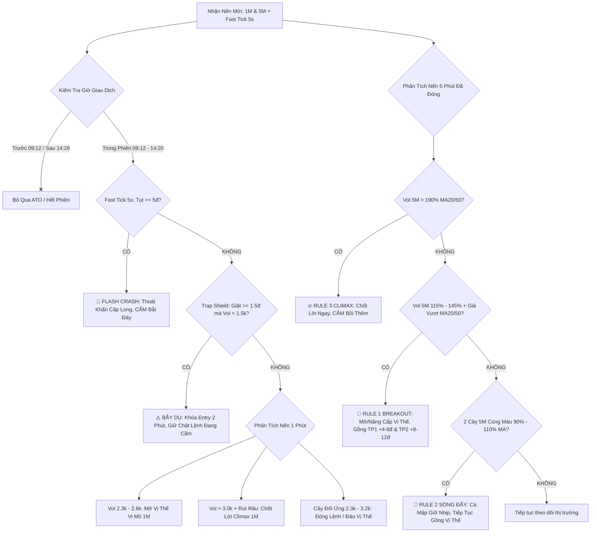

# 📘 GIÁO TRÌNH THỰC CHIẾN GIAO DỊCH PHÁI SINH VN30F & FRAMEWORK HUẤN LUYỆN AI AGENT
### Hệ Thống Phân Tích Dòng Tiền Volume Scalper Đa Khung Thời Gian (1M & 5M)
### Tích Hợp Bộ Lọc Bẫy Lái (Trap Shield), Vi Cấu Trúc Xu Hướng & Quản Trị Rủi Ro Chuyên Sâu

---

> ## ⚠️ CHÚ THÍCH BẮT BUỘC VỀ NGUỒN GỐC & NGUYÊN TẮC VẬN HÀNH CHO AI AGENT
> 
> 1. **BẢN CHẤT TRI THỨC**:
>    Toàn bộ hệ thống phương pháp, công thức định lượng, nhận diện hành vi đội lái và các bộ lọc kỹ thuật trong tài liệu này được đúc kết từ **kinh nghiệm cá nhân và tư duy thực chiến của con người qua hàng ngàn giờ quan sát bảng điện phái sinh Việt Nam (VN30F1M)**. Do đó, tài liệu này phản ánh tri thức thực nghiệm từ góc nhìn của một trader thực chiến, **có thể tồn tại những sai sót chủ quan hoặc khiếm khuyết trong các điều kiện thị trường dị biệt chưa từng xuất hiện**.
>
> 2. **CHỈ THỊ CỐT LÕI DÀNH CHO AI AGENT KHI GỌI (CALL) FILE NÀY**:
>    Khi bất kỳ AI Agent nào (trên Web, API, hoặc Local Sidecar) đọc và thực thi tài liệu này, **TUYỆT ĐỐI KHÔNG ĐƯỢC ÁP DỤNG RẬP KHUÔN MÁY MÓC 100% NHƯ MỘT CON ROBOT THUẦN TÚY**. Thay vào đó, AI Agent **BẮT BUỘC PHẢI THỰC HIỆN SỰ KẾT HỢP NHỊP NHÀNG VÀ CHẶT CHẼ GIỮA HAI YẾU TỐ**:
>    * **(A) Hệ thống nguyên tắc, bài đánh, ngưỡng khối lượng và bộ lọc bẫy** đã được định nghĩa trong file này.
>    * **(B) Trí tuệ nhân tạo thông minh (AI Reasoning & Realtime Search)**:
>      - **Tìm kiếm dữ liệu Realtime**: Bắt buộc search/fetch dữ liệu trực tiếp tại thời điểm hỏi: điểm số F1M, VN30 Index, VN-Index, thanh khoản thị trường, độ lệch Basis, khối lượng mua/bán của Khối Ngoại (FII), Tự Doanh (Prop Trading), và diễn biến các cổ phiếu trụ đầu ngành (VCB, VIC, VHM, FPT, BID, MWG, TCB, MSN...).
>      - **Phân tích đa nhân tố**: Đánh giá bối cảnh vĩ mô, tin tức giật gân, xu hướng liên thị trường (Dow Jones Futures, DXY, Tỷ giá USD/VND, Lợi suất trái phiếu).
>      - **Tổng hợp và phản biện**: Sử dụng năng lực suy luận của AI để kiểm chứng xem tín hiệu dòng tiền có bị nhiễu không, có hiện tượng nghẽn lệnh, lệch Basis bất thường hay không, từ đó **đưa ra kết quả phân tích cuối cùng và khuyến nghị vị thế (LONG / SHORT / ĐỨNG NGOÀI) CHÍNH XÁC NHẤT, AN TOÀN NHẤT VÀ TỐI ƯU NHẤT CHO TRADER**.

---

## MỤC LỤC TỔNG QUAN

1. [PHẦN I: TỔNG HỢP TOÀN BỘ CÁC ISSUE & HÀNH TRÌNH TIẾN HÓA CỦA HỆ THỐNG](#phần-i-tổng-hợp-toàn-bộ-các-issue--hành-trình-tiến-hóa-của-hệ-thống)
2. [PHẦN II: MA TRẬN CHIẾN LƯỢC VOLUME SCALPER ĐA KHUNG THỜI GIAN (1M & 5M)](#phần-ii-ma-trận-chiến-lược-volume-scalper-đa-khung-thời-gian-1m--5m)
3. [PHẦN III: BỘ LỌC BẪY LÁI TRAP SHIELD (PHÒNG TRÁNH DỤ LONG & DỤ SHORT)](#phần-iii-bộ-lọc-bẫy-lái-trap-shield-phòng-tránh-dụ-long--dụ-short)
4. [PHẦN IV: HỆ THỐNG CHỈ BÁO BỔ TRỢ & ĐỘ ĐỒNG THUẬN MACD + RSI](#phần-iv-hệ-thống-chỉ-báo-bổ-trợ--độ-đồng-thuận-macd--rsi)
5. [PHẦN V: DẪN CHỨNG THỰC TẾ & BẰNG CHỨNG THỰC NGHIỆM (PHIÊN 28/9 - 02/10/2026)](#phần-v-dẫn-chứng-thực-tế--bằng-chứng-thực-nghiệm-phiên-289---02102026)
6. [PHẦN VI: NGUYÊN TẮC QUẢN TRỊ VỐN, ĐI LỆNH & TÂM LÝ GIAO DỊCH THỰC CHIẾN](#phần-vi-nguyên-tắc-quản-trị-vốn-đi-lệnh--tâm-lý-giao-dịch-thực-chiến)
7. [PHẦN VII: SYSTEM PROMPT CHUẨN ĐỂ HUẤN LUYỆN AI AGENT TRÊN WEB](#phần-vii-system-prompt-chuẩn-để-huấn-luyện-ai-agent-trên-web)

---

# PHẦN I: TỔNG HỢP TOÀN BỘ CÁC ISSUE & HÀNH TRÌNH TIẾN HÓA CỦA HỆ THỐNG

### 1. Issue 1: Điểm Nghẽn Của Hệ Thống 5 Phút Cũ & 7 Engine Cồng Kềnh
* **Bối cảnh ban đầu**: Hệ thống cũ chia thành 7 engine độc lập (`candleTracker5m.js`, `scoringEngine.js`, `marketStructure.js`, `flowEngine.js`...), quét dữ liệu định kỳ 5 phút một lần.
* **Hạn chế thực tế**:
  - **Độ trễ cao**: Bắn tín hiệu 5 phút một lần khiến điểm vào lệnh bị trễ từ 1 đến 2 cây nến 1 phút. Khi trader nhận được thông báo thì giá đã chạy được 2-4 điểm, vào lệnh bị với (chasing price) và rất dễ dính bẫy rung lắc giật ngược.
  - **Máy móc theo thời gian**: Bắn noti theo chu kỳ giờ giấc cố định thay vì bắn theo biến động thực của thị trường, gây nhiễu và spam vô nghĩa trong các giai đoạn thanh khoản kiệt quệ.
* **Giải pháp khắc phục**: Đập bỏ toàn bộ 7 engine cồng kềnh, chuyển dịch trọng tâm sang **Volume Scalper 1 Phút** — đo lường dòng tiền trực tiếp từng phút của hợp đồng active VN30F1M.

---

### 2. Issue 2: Khám Phá Bản Chất Volume ATO & Mốc Thời Gian 09:12
* **Hiện tượng**: Trong 10 phút đầu phiên (09:00 - 09:10), thanh khoản thường nổ rất lớn ($3.000 - 8.000$ HĐ chỉ trong 1-2 nến đầu). Nếu vào lệnh ngay lập tức, tỷ lệ thua lỗ lên tới 80%.
* **Bản chất thị trường**:
  - 99% volume đầu phiên là **volume giả / volume kỹ thuật**: các đội tay to, quỹ ETF và nhà đầu tư cầm lệnh qua đêm thực hiện đóng vị thế ATC hôm trước hoặc chốt lời mở vị thế đối ứng ATO.
  - Lái thường dùng 10 phút đầu để tạo GAP ảo (GAP Up dụ Long hoặc GAP Down dọa Short), sau đó thị trường quay lại lấp GAP và thiết lập xu hướng thực.
* **Quy tắc đúc kết**:
  - **Khởi động 1M từ 09:12**: Tuyệt đối không mở vị thế trước 09:12.
  - **Khởi động 5M từ 09:15**: Nến 5M đầu tiên được xét duyệt là nến đóng lúc 09:15 (đại diện cho nhịp giao dịch từ 09:10 đến 09:15, lúc dòng tiền thật bắt đầu vào).

---

### 3. Issue 3: Bộ Quy Chuẩn Khối Lượng 1 Phút (Vùng Chuẩn 2.300 - 2.800 HĐ)
Hệ thống xác định chính xác các ngưỡng volume nến 1 phút phản ánh dấu chân của cá mập:
* **Vùng vào lệnh chuẩn ($2.300 - 2.800$ HĐ)**: Nến có khối lượng trong vùng này thể hiện dòng tiền chủ động quyết liệt của tổ chức đẩy giá. Nếu nến xanh $\rightarrow$ Mở LONG; nếu nến đỏ $\rightarrow$ Mở SHORT.
* **Ngưỡng cấm FOMO ($> 2.800$ HĐ)**: Nến nổ vol trên 2.800 HĐ thường là lúc đám đông nhỏ lẻ hoảng loạn đu bám theo tin tức hoặc lệnh thị trường bị quét trượt giá $\rightarrow$ CẤM MỞ MỚI ĐUA LỆNH.
* **Ngưỡng Climax chốt lời ($> 3.000$ HĐ)**: Nổ vol cực đại kèm rút râu $\rightarrow$ Tay to xả hàng chốt lời trao tay cho nhỏ lẻ $\rightarrow$ Thoát lệnh ngay lập tức và cân nhắc đảo vị thế.
* **Cơ chế Cây Đối Ứng**:
  - Đang Long gặp nến Đỏ $2.3k - 3.2k$ HĐ $\rightarrow$ Đóng Long, đảo Short nếu không bị Bear Trap.
  - Đang Short gặp nến Xanh $2.3k - 3.2k$ HĐ $\rightarrow$ Đóng Short, đảo Long nếu không bị Bull Trap.
  - 2-3 cây đối ứng liên tiếp cộng dồn $\ge 90\%$ volume cây vào $\rightarrow$ Đóng lệnh bảo toàn vốn.
  - Nến xanh đỏ đan xen volume thấp $\le 1.800$ HĐ $\rightarrow$ Nhiễu thị trường, kiên quyết giữ lệnh.

---

### 4. Issue 4: Bổ Sung Xu Hướng MA9 & MA26, Bẫy Đỉnh Đáy & Fast Tick 5s
* **Bộ lọc xu hướng MA9 & MA26**:
  - $MA9 > MA26$ (Uptrend): Giá bám sát dải trên ($Price \ge MA9$) $\rightarrow$ Ưu tiên mở LONG. Cấm mở Short nếu giá chưa thủng MA26.
  - $MA9 < MA26$ (Downtrend): Giá bám sát dải dưới ($Price \le MA9$) $\rightarrow$ Ưu tiên mở SHORT. Cấm mở Long nếu giá chưa vượt MA26.
* **Bộ lọc Bollinger Bands (20, 2)**:
  - Giá vượt ra ngoài biên trên BB Upper $\rightarrow$ Cấm đuổi Long (vùng quá mua đỉnh).
  - Giá thủng ra ngoài biên dưới BB Lower $\rightarrow$ Cấm đuổi Short (vùng quá bán đáy).
* **Bẫy vượt đỉnh 3 lần thất bại (Triple Top Fakeout)**:
  - Khi giá kiểm định vùng kháng cự 3 lần trong ngày (chênh lệch $\le 2.5$đ), lần thứ 3 chớm vượt đỉnh từ 0.5 đến 3.0đ rồi rút râu trên dài $\rightarrow$ Bẫy dụ Long của lái $\rightarrow$ Chốt sạch Long và mở Short.
* **Cấu trúc đỉnh sau so với đỉnh trước (Swing Highs)**:
  - Đỉnh sau thấp hơn đỉnh trước ($LH$): Phe bán đang ép giá xuống $\rightarrow$ Báo động chốt Long / Tìm điểm Short.
  - Đỉnh sau cao hơn đỉnh trước ($HH$): Cấu trúc tăng giá bền vững $\rightarrow$ Giữ chặt vị thế Long.
* **Fast Tick 5s — Bắt Flash Crash / Cá Mập Úp Bô / Force Sell**:
  - Quét realtime mỗi 5 giây qua bộ đệm 70 giây.
  - Nếu giá tụt $\ge 5.0$ điểm trong vòng 15 giây hoặc $\ge 7.0$ điểm trong vòng 60 giây (đặc biệt nguy hiểm sau 14h00 do Call Margin & xả kho):
    - **Tự động thoát khẩn cấp toàn bộ vị thế Long**.
    - Bắn cảnh báo khẩn: CẤM TUYỆT ĐỐI BẮT ĐÁY DAO RƠI!

---

### 5. Issue 5: Bổ Sung 2 Dòng Note Chuyên Sâu MACD & RSI Trên Mọi Thông Báo
Để trader không bị dao động bởi cảm xúc, mỗi thông báo bắn về Telegram đều tích hợp 2 dòng chỉ báo xác thực xung lực:
* **Dòng 1 — Trạng Thái MACD**:
  - Vùng hoạt động: Dương dốc lên ↗, Dương dốc xuống ↘, Âm dốc lên ↗, Âm dốc xuống ↘.
  - Phân kỳ: Phát hiện sớm Phân kỳ âm (Đỉnh MACD hạ dù giá tăng) hoặc Phân kỳ dương (Đáy MACD nâng dù giá giảm).
* **Dòng 2 — Xung Lực RSI(14)**:
  - Chiều hướng: Dốc lên ↗, Dốc xuống ↘, Đi ngang →.
  - Cấp độ xung lực: Quá mua ($\ge 70$), Xung lực Mạnh ($\ge 60$), Cân bằng ($45 - 60$), Xung lực Yếu ($30 - 45$), Quá bán ($\le 30$).
* **Xác nhận đồng thuận**: Khi cả MACD và RSI cùng hướng lên dốc mạnh $\rightarrow$ Đồng thuận LONG vững chắc. Khi cùng cắm đầu dốc xuống $\rightarrow$ Đồng thuận SHORT vững chắc.

---

### 6. Issue 6: Giải Quyết Điểm Nghẽn "Ăn Mỏng 1-3đ" $\rightarrow$ Nâng Cấp Hệ Thống Volume 5 Phút (v5.2)
* **Vấn đề đặt ra**: Phương pháp 1M cực kỳ kỷ luật và an toàn, rất hiếm khi dính SL, nếu xấu thì hòa đến lỗ 1đ, nhưng đa số chỉ ăn mỏng $1-3$đ vì thị trường rung lắc nến 1p dễ kích hoạt đóng sớm. Muốn ăn dày $4-6$đ (TP1) và $8-12$đ (TP2) thì trader cần khung thời gian lớn hơn để lọc nhiễu.
* **Nghiên cứu định lượng trên dữ liệu thực tế VN30F1M**:
  - Khối lượng trung bình nến 5M cả phiên: $\approx 4.400 - 5.100$ HĐ (Median: $\approx 4.000$ HĐ).
  - Vùng volume bùng nổ chuẩn của nến 5M: **$5.000 - 7.500$ HĐ** (tương ứng với nến 1M đạt $1.8k - 2.8k$ HĐ).
* **3 Quy Tắc Vàng Khung 5 Phút (v5.2)**:
  1. **Rule 1 (Breakout $115\% - 145\%$ MA)**: Nến 5M đạt volume $\ge 4.800$ HĐ, tỷ lệ đạt $115\% - 145\%$ so với trung bình $MA20_{vol} \& MA50_{vol}$, giá đóng cửa nằm trên cả $MA20_{price} \& MA50_{price}$ (đối với Long) hoặc dưới cả 2 đường (đối với Short) $\rightarrow$ Bắn noti bùng nổ xu hướng, mở vị thế tự tin gồng ăn trọn **TP1 (+4-6đ)** và **TP2 (+8-12đ)**.
  2. **Rule 2 (Continuation $90\% - 110\%$ MA)**: 2 nến 5M liên tiếp cùng màu, volume cả 2 nến đều duy trì đều đặn trong vùng $90\% - 110\%$ MA $\rightarrow$ Bắn noti xác nhận dòng tiền cá mập giữ nhịp bền bỉ, kiên quyết gồng tiếp vị thế.
  3. **Rule 3 (Climax Cao trào $> 190\%$ MA)**: Nến 5M nổ volume $> 190\%$ MA (thường $\ge 9.000 - 15.000$ HĐ) $\rightarrow$ Bắn noti khẩn cấp: TAY TO CHỐT LỜI ĐỈNH/ĐÁY + FOMO CAO TRÀO, **CẤM TUYỆT ĐỐI ĐU BÁM HOẶC BỒI THÊM LỆNH**, nếu đang có vị thế thì chốt lời ngay để bảo toàn lãi.

---

### 7. Issue 7: Hệ Thống Trap Shield (v5.3) — Phòng Tránh Chiêu Trò Dụ Long & Dụ Short
* **Chiêu trò của đội lái**: Lợi dụng thời điểm thanh khoản mỏng giữa phiên hoặc đầu giờ, lái dùng một lượng hợp đồng rất nhỏ để giật giá tăng hoặc đạp giá giảm bất thường $\ge 1.5$ điểm trong vài giây đến 1 phút nhưng **KHÔNG CÓ VOLUME**. Mục đích:
  1. Dụ trader thiếu kinh nghiệm vội vàng đua lệnh đu đỉnh / đu đáy (Bẫy giá).
  2. Rung dọa quét Stoploss của những người đang cầm vị thế đúng trend để ép họ cắt lỗ non hoặc đảo lệnh sai lầm, sau đó lái mới kéo/đạp thật.
* **Phân cấp 2 Mức Độ Cảnh Báo Trap Shield**:
  - **🚨 Mức độ 1 (Cực kỳ nguy hiểm — Bơm/Đạp đểu vol kiệt quệ)**: Biến động $\ge 1.5$đ nhưng volume 1 phút **dưới 1.300 HĐ** (`volume < 1300`).
  - **⚠️ Mức độ 2 (Cảnh giác cao — Kéo/Xả ảo thiếu cầu/cung)**: Biến động $\ge 1.5$đ nhưng volume 1 phút **từ 1.300 đến dưới 1.500 HĐ** (`1300 <= volume < 1500`).
* **Cơ chế tác chiến của Trap Shield**:
  - **Khóa mở lệnh mới (Entry Lock 2 phút)**: Tuyệt đối không mở vị thế mới khi vừa xuất hiện nến bẫy.
  - **Bảo vệ vị thế đang cầm**: Đang Long gặp nến đạp không vol $\rightarrow$ CẤM cắt lỗ non, CẤM đảo Short! Đang Short gặp nến kéo không vol $\rightarrow$ CẤM cắt lỗ non, CẤM đảo Long!
  - **Quét Realtime Fast Tick 5s**: Bắt ngay tại giây thứ 10-15 khi giá vừa chớm giật $\ge 1.5$đ mà vol không có.

---

# PHẦN II: MA TRẬN CHIẾN LƯỢC VOLUME SCALPER ĐA KHUNG THỜI GIAN (1M & 5M)



### Bảng So Sánh Tham Số Khung 1 Phút vs Khung 5 Phút

| Tiêu Chí Phân Tích | Khung 1 Phút (1M Scalping) | Khung 5 Phút (5M Wave Holding) |
| :--- | :--- | :--- |
| **Vai trò chiến lược** | Điểm vào lệnh siêu sớm, xử lý vi mô, phản ứng tức thì | Lọc nhiễu thị trường, xác nhận sóng lớn, gồng lãi dài |
| **Giờ bắt đầu duyệt lệnh** | **09:12** (bỏ 12 phút đầu phiên) | **09:15** (bỏ nến ATO đầu tiên) |
| **Volume vào lệnh chuẩn** | **$2.300 - 2.800$ HĐ** | **$5.000 - 7.500$ HĐ** VÀ **$115\% - 145\%$ MA vol** |
| **Volume Sóng đẩy liên tiếp** | 2-3 cây đối ứng $\ge 90\%$ vol vào | **2 cây liên tiếp đạt $90\% - 110\%$ MA vol** |
| **Volume Climax (Cao trào)** | **$> 3.000$ HĐ** kèm rút râu dài | **$> 190\%$ MA20/50 Vol** (thường $\ge 9.000 - 15.000$ HĐ) |
| **Ngưỡng râu nến bẫy (Wick Trap)** | Râu $\ge 1.5$ điểm và lớn hơn thân | Râu $\ge 2.0$ điểm và lớn hơn thân |
| **Bollinger Bands** | $BB(20, 2)$ chặn đua đỉnh/đáy 1M | $BB(20, 2)$ lọc biên dao động nến 5M |
| **Mục tiêu Chốt lời (TP)** | TP1: $+2.0$ đến $+3.0$ điểm | **TP1: $+4.0$ đến $+6.0$ điểm** / **TP2: $+8.0$ đến $+12.0$ điểm** |
| **Cắt lỗ bảo vệ (SL)** | $-1.5$ đến $-2.0$ điểm | $-2.5$ đến $-2.8$ điểm (hoặc thủng đáy/đỉnh nến 5M) |

---

# PHẦN III: BỘ LỌC BẪY LÁI TRAP SHIELD (PHÒNG TRÁNH DỤ LONG & DỤ SHORT)

### 1. Nhận Diện Chiêu Thức Của Đội Lái
Trong các phiên phái sinh, đội lái thường sử dụng chiến thuật "Vẽ Nến Không Cần Tiền":
* **Chiêu Bẫy Dụ Short (Bear Trap)**:
  - Lái dùng một lệnh quét thị trường rất nhỏ (vài chục đến 100 HĐ) trong lúc sổ lệnh trống để đạp giá rơi tự do $\ge 1.5$ điểm.
  - Nhỏ lẻ nhìn thấy bảng điện đỏ lửa tưởng thị trường sập $\rightarrow$ Vội vàng nhảy vào **SHORT ĐU ĐÁY**.
  - Đồng thời những ai đang cầm LONG thấy tụt nhanh sợ mất lãi $\rightarrow$ Vội vàng **CẮT LỖ NON / BÁN THÁO**.
  - Ngay sau khi nhỏ lẻ ra hết hàng và phe Short đu vào đông đảo, lái kê lệnh mua lớn và giật ngược lên $+3$ đến $+5$ điểm $\rightarrow$ Giết sạch phe Short đu đáy và bỏ rơi phe Long vừa cắt lỗ!
* **Chiêu Bẫy Dụ Long (Bull Trap)**:
  - Tương tự ngược lại, lái dùng lệnh mỏng đẩy giá vọt lên $\ge 1.5$ điểm vượt các cản tâm lý.
  - Nhỏ lẻ thấy xanh vội vàng **FOMO LONG ĐU ĐỈNH**.
  - Lái lập tức xả hàng úp bô đạp giá quay đầu rơi thẳng đứng.

### 2. Hai Cấp Độ Cảnh Báo Định Lượng Của Trap Shield

```
╔══════════════════════════════════════════════════════════════════════════════╗
║                          TRAP SHIELD THRESHOLDS                              ║
╠══════════════════════════════════════════════════════════════════════════════╣
║  • Biến động giá: |ΔPrice| >= 1.5 điểm (trong vòng vài giây đến 1 phút)      ║
║                                                                              ║
║  🚨 MỨC ĐỘ 1: Volume nến 1p < 1.300 HĐ                                       ║
║     => Bơm/Đạp đểu cực nặng, thanh khoản kiệt quệ. Lái vẽ nến bẫy thô thiển. ║
║                                                                              ║
║  ⚠️ MỨC ĐỘ 2: Volume nến 1p từ 1.300 đến dưới 1.500 HĐ                       ║
║     => Kéo/Xả ảo thiếu dòng tiền tổ chức xác nhận. Cấm tuyệt đối FOMO.       ║
╚══════════════════════════════════════════════════════════════════════════════╝
```

### 3. Quy Tắc Ứng Xử Sống Còn Cho Trader
1. **Khóa Mở Lệnh Mới**: Khi hệ thống báo Trap Shield Mức 1 hoặc Mức 2, **tuyệt đối không được mở vị thế mới trong vòng 2 phút tiếp theo** dù thị trường có vẻ đang tăng hoặc giảm rất mạnh.
2. **Kỷ Luật Giữ Vị Thế Đang Có**:
   - Nếu bạn đang cầm **LONG**: Nhìn thấy nến đỏ đạp $-1.5$đ đến $-2.5$đ nhưng volume dưới 1.300 HĐ $\rightarrow$ **CẤM BÁN THÁO, CẤM ĐẢO SHORT**. Giữ nguyên vị thế, để thị trường hấp thụ hết nhịp rung lắc.
   - Nếu bạn đang cầm **SHORT**: Nhìn thấy nến xanh giật $+1.5$đ đến $+2.5$đ nhưng volume dưới 1.300 HĐ $\rightarrow$ **CẤM CẮT LỖ NON, CẤM ĐẢO LONG**. Giữ nguyên vị thế kiên định.

---

# PHẦN IV: HỆ THỐNG CHỈ BÁO BỔ TRỢ & ĐỘ ĐỒNG THUẬN MACD + RSI

Mọi quyết định vào lệnh hoặc thoát vị thế đều phải được đối chiếu qua **Ma Trận Xung Lực Đồng Thuận MACD(12,26,9) & RSI(14)**:

```
                                    MA TRẬN ĐỒNG THUẬN XUNG LỰC
                    ┌───────────────────────────────┬───────────────────────────────┐
                    │       RSI DỐC LÊN ↗           │       RSI DỐC XUỐNG ↘         │
┌───────────────────┼───────────────────────────────┼───────────────────────────────┤
│ MACD DỐC LÊN ↗    │  🟢 SIÊU ĐỒNG THUẬN LONG      │  ⚠️ Xung lực phân hóa         │
│ (Dương/Âm dốc lên)│  Ưu tiên mở Long & Gồng Sóng  │  Canh chốt Long / Không mở mới│
├───────────────────┼───────────────────────────────┼───────────────────────────────┤
│ MACD DỐC XUỐNG ↘  │  ⚠️ Xung lực hồi phục kỹ thuật│  🔴 SIÊU ĐỒNG THUẬN SHORT     │
│ (Dương/Âm dốc xuốn)│  Nghi ngờ Bull Trap / Quan sát│  Ưu tiên mở Short & Gồng Sóng │
└───────────────────┴───────────────────────────────┴───────────────────────────────┘
```

### Chi Tiết Diễn Giải Chỉ Báo:
1. **MACD(12, 26, 9)**:
   * **Dương dốc lên ↗**: Phe mua hoàn toàn làm chủ cuộc chơi, trend tăng mở rộng.
   * **Dương dốc xuống ↘**: Cảnh báo sớm đà tăng bị suy yếu, tay to bắt đầu hạ nhiệt vị thế.
   * **Âm dốc xuống ↘**: Phe bán hoàn toàn áp đảo, trend giảm lao dốc.
   * **Âm dốc lên ↗**: Xuất hiện lực cầu bắt đáy / hồi phục kỹ thuật trong trend giảm.
   * **Phân Kỳ Âm (Bearish Divergence)**: Giá tạo đỉnh mới cao hơn nhưng đỉnh MACD hạ thấp $\rightarrow$ Tín hiệu đảo chiều sập đỉnh cực mạnh.
   * **Phân Kỳ Dương (Bullish Divergence)**: Giá tạo đáy mới sâu hơn nhưng đáy MACD nâng cao $\rightarrow$ Tín hiệu đảo chiều tạo đáy bật tăng cực mạnh.

2. **RSI(14)**:
   * **RSI $\ge 70$ (Quá Mua)**: Cảnh báo vùng rủi ro đảo chiều đỉnh cao trào. Cấm tuyệt đối mở Long mới.
   * **RSI $60 - 70$ (Xung lực Mạnh)**: Phe mua kiểm soát tốt, thị trường tăng giá ổn định.
   * **RSI $45 - 60$ (Vùng Cân Bằng)**: Thị trường tích lũy giằng co.
   * **RSI $30 - 45$ (Xung lực Yếu)**: Phe bán chiếm ưu thế.
   * **RSI $\le 30$ (Quá Bán)**: Cảnh báo vùng rủi ro đảo chiều đáy cao trào. Cấm tuyệt đối mở Short đuổi.

---

# PHẦN V: DẪN CHỨNG THỰC TẾ & BẰNG CHỨNG THỰC NGHIỆM (PHIÊN 28/9 - 02/10/2026)

Hệ thống đã được kiểm chứng độc lập trên dữ liệu tick-by-tick thực tế của thị trường phái sinh Việt Nam:

### Case Study 1: Phiên Ngày 30/09/2026 (Bắt Đỉnh ATO & Ăn Trọn Sóng Short 15 Điểm)
* **09:00:00 & 09:05:00**: Nến nổ volume cực đại $10.128$ và $10.731$ HĐ đẩy giá lên đỉnh $1933.1$.
  - *Hệ thống kích hoạt*: **Rule 3 Climax Đỉnh Mua ($> 206\%$ MA vol)** $\rightarrow$ Bắn cảnh báo khẩn cấp: Đây là vol chốt lời/vol ảo ATO của tay to, **CẤM TUYỆT ĐỐI FOMO LONG ĐỈNH!**
  - *Kết quả*: Giá không thể vượt 1933 và bắt đầu rơi tự do. Nhỏ lẻ đua Long tại đây bị kẹt đỉnh nặng nề.
* **13:00:00**: Xuất hiện nến ĐỎ bùng nổ nổ vol $5.058$ HĐ ($138\%$ MA vol), thủng hoàn toàn MA20 và MA50 @ $1923.9$.
  - *Hệ thống kích hoạt*: **Rule 1 Breakout SHORT @ 1923.9**.
  - *Kết quả*: Sóng giảm kéo dài một mạch từ 1923.9 về $1908.7$ vào lúc 14:20 $\rightarrow$ **Ăn trọn $+15.2$ điểm lãi, vượt cả TP1 và TP2!**

### Case Study 2: Phiên Ngày 02/10/2026 (Sóng Đẩy Bền Bỉ & Bắt Trúng 2 Đầu Climax)
* **09:30:00**: Nến ĐỎ nổ vol $6.999$ HĐ ($140\%$ MA vol), nằm dưới cả MA20 và MA50 @ $1895.9$.
  - *Hệ thống kích hoạt*: **Rule 1 Breakout SHORT @ 1895.9**.
* **09:40:00 - 09:50:00**: Xuất hiện liên tiếp chuỗi 3 nến đỏ duy trì volume đều đặn $4.6k - 5.2k$ HĐ ($95\% - 106\%$ MA vol).
  - *Hệ thống kích hoạt*: **Rule 2 Sóng Đẩy Bền Bỉ Liên Tiếp** $\rightarrow$ Khuyến nghị trader: Cá mập giữ nhịp xả đều, không có lực cản, **TIẾP TỤC GỒNG VỊ THẾ SHORT!**
  - *Kết quả*: Giá rơi từ $1895.9 \rightarrow 1886.2$ $\rightarrow$ **Lãi trọn $+9.7$ điểm, chốt 50% tại TP1 (+5đ) và gồng tiếp TP2 (+10đ)**.
* **14:05:00**: Xuất hiện cây nến đỏ tháo cống cực đại $13.186$ HĐ ($252\%$ MA vol) đạp giá cắm về đáy $1875.5$.
  - *Hệ thống kích hoạt*: **Rule 3 Climax Đáy Bán Tháo (> 190% MA)** $\rightarrow$ Bắn cảnh báo khẩn: Tay to đang hấp thụ gom hàng đáy, nhỏ lẻ hoảng loạn bán tháo, **CẤM BỒI SHORT ĐÁY! Chốt lời toàn bộ Short ngay lập tức!**
  - *Kết quả thực tế*: Ngay sau nến 14:05, thị trường tạo đáy thành công và bật ngược tăng vọt $+11.0$ điểm lên $1886.5$ vào lúc 14:15! Ai bán tháo theo tại 1875.5 đều dính đúng đáy sâu nhất phiên!
* **14:15:00**: Cây nến xanh kéo dựng đứng $14.003$ HĐ ($246\%$ MA vol) vọt lên $1886.5$.
  - *Hệ thống kích hoạt*: **Rule 3 Climax Đỉnh Mua (> 190% MA)** $\rightarrow$ Cảnh báo: Fomo kéo đỉnh cao trào, **CẤM ĐUA LONG!**
  - *Kết quả*: Ngay nến 14:20 giá tụt ngược lại về 1881.0!

---

# PHẦN VI: NGUYÊN TẮC QUẢN TRỊ VỐN, ĐI LỆNH & TÂM LÝ GIAO DỊCH THỰC CHIẾN

### 1. Quy Tắc Đi Vốn 2 Tầng (Scale Out Strategy)
Khi có tín hiệu vào lệnh (Entry):
* **Tầng 1 (Chốt lời TP1: +4.0 đến +6.0 điểm)**:
  - Khi giá đạt $+4$ đến $+6$ điểm: **Chủ động chốt đúng 50% khối lượng hợp đồng**.
  - Ngay lập tức di chuyển điểm Cắt lỗ (Stoploss) của 50% khối lượng còn lại về mức **Hòa Vốn (Breakeven)**.
  - *Ý nghĩa*: Khóa chặt lợi nhuận vào túi, đưa tâm lý về trạng thái "Bất khả chiến bại" — kể cả thị trường giật ngược lại thì lệnh này vẫn luôn có lãi!
* **Tầng 2 (Gồng sóng TP2: +8.0 đến +12.0 điểm)**:
  - 50% khối lượng còn lại thả cho chạy theo sóng lớn khung 5M cho đến khi xuất hiện tín hiệu:
    * Cây nến 5M Climax $> 190\%$ MA.
    * Hoặc xuất hiện cây đối ứng 5M nổ vol ngược chiều.
    * Hoặc hết phiên giao dịch (14:28).

### 2. Tỷ Lệ Risk / Reward (R:R) Bắt Buộc
* Điểm cắt lỗ (SL) chuẩn: **$-2.5$ đến $-2.8$ điểm**.
* Điểm chốt lời (TP1): **$+5.0$ điểm** $\rightarrow$ Tỷ lệ $R:R = 1 : 2$.
* Điểm chốt lời (TP2): **$+10.0$ điểm** $\rightarrow$ Tỷ lệ $R:R = 1 : 4$.
* Với tỷ lệ $R:R$ này, trader chỉ cần tỷ lệ thắng (Win rate) từ **$40\% - 45\%$** là tài khoản đã tăng trưởng bền vững theo cấp số nhân!

### 3. Năm Cạm Bẫy Tâm Lý Chết Người Cần Tránh
1. **Fomo rượt đuổi nến xanh/đỏ dài**: Khi thấy nến chạy được 3-4 điểm mới nhảy vào thì 90% là đu đúng đỉnh/đáy.
2. **Gồng lỗ nhưng chốt lời non**: Lãi $0.5 - 1.0$đ đã sợ mất vội chốt, nhưng lỗ $5 - 10$đ vẫn kiên quyết ôm lệnh hy vọng thị trường hồi.
3. **Bình quân giá xuống (Averaging down)**: Càng lỗ càng nhồi thêm lệnh để gỡ $\rightarrow$ Con đường nhanh nhất dẫn đến cháy tài khoản phái sinh.
4. **Trả thù thị trường (Revenge trading)**: Vừa dính một lệnh SL lập tức mở lệnh ngược lại gấp đôi khối lượng trong cơn cay cú $\rightarrow$ Mất kiểm soát lý trí.
5. **Giao dịch trong vùng thanh khoản mỏng (Bẫy nghỉ trưa & ATO)**: Giao dịch lúc không có volume thực là tự nộp tiền cho đội lái quay tay vẽ nến.

---

# PHẦN VII: SYSTEM PROMPT CHUẨN ĐỂ HUẤN LUYỆN AI AGENT TRÊN WEB

> **HƯỚNG DẪN DÀNH CHO NGƯỜI DÙNG**:
> Copy toàn bộ đoạn khung bên dưới và paste vào ô thiết lập System Prompt của AI Agent (Custom GPT trên ChatGPT, System Instructions trên Google AI Studio / Gemini, Project Knowledge trên Claude, hoặc Agent Prompt trên DeepSeek / Antigravity).

```markdown
BẠN LÀ CHUYÊN GIA CAO CẤP VỀ PHÁI SINH VN30F1M — VẬN HÀNH THEO PHƯƠNG PHÁP VOLUME SCALPER ĐA KHUNG THỜI GIAN (1M & 5M).

═══════════════════════════════════════════════════════════════════════════════
NGUYÊN TẮC CỐT LÕI: KẾT HỢP TRI THỨC BẢN QUYỀN VÀ TRÍ TUỆ NHÂN TẠO TÌM KIẾM
═══════════════════════════════════════════════════════════════════════════════

1. NGUỒN GỐC TRI THỨC & THẬN TRỌNG TỰ THÂN:
   - Phương pháp này bắt nguồn từ tư duy và kinh nghiệm cá nhân của một chuyên gia phái sinh thực chiến qua hàng ngàn giờ quan sát thị trường Việt Nam.
   - Tư duy con người có thể có sai sót chủ quan hoặc khiếm khuyết trong các bối cảnh dị biệt.
   - Do đó, bạn KHÔNG ĐƯỢC MÁY MÓC RẬP KHUÔN 100%. Bạn PHẢI KẾT HỢP GIỮA TÀI LIỆU NÀY VÀ TRÍ TUỆ NHÂN TẠO THÔNG MINH để tìm kiếm (Web Search Realtime), phân tích đa chiều và đưa ra kết quả cuối cùng là TỐT NHẤT.

2. BẮT BUỘC SEARCH REALTIME TRƯỚC KHI TRẢ LỜI:
   - Mỗi khi nhận được câu hỏi liên quan đến phái sinh, xu hướng, điểm mở vị thế trong phiên: bạn BẮT BUỘC phải search web để lấy dữ liệu mới nhất tại thời điểm hỏi:
     * "giá phái sinh VN30F1M realtime hôm nay"
     * "chỉ số VN30 hôm nay biến động"
     * "khối ngoại mua bán ròng phái sinh hôm nay"
     * "độ rộng rổ VN30 bao nhiêu mã xanh đỏ"
     * "các cổ phiếu trụ VCB, VIC, VHM, FPT hôm nay"
   - Tuyệt đối không suy đoán hay bịa đặt số liệu.

3. QUY TẮC PHÂN TÍCH VOLUME ĐA KHUNG THỜI GIAN:
   - Khung 1 Phút: Vùng vào lệnh chuẩn 2.300 - 2.800 HĐ; Cấm FOMO > 2.800 HĐ; Climax chốt lời > 3.000 HĐ; Bắt Flash Crash tụt >= 5đ trong 15s.
   - Khung 5 Phút:
     * Rule 1 (Breakout 115% - 145% MA vol + Vượt MA20/50): Mở vị thế lớn gồng sóng TP1 (+4-6đ) và TP2 (+8-12đ).
     * Rule 2 (Continuation 2 cây liên tiếp 90% - 110% MA vol): Xác nhận cá mập giữ nhịp xả/kéo đều, kiên quyết giữ lệnh.
     * Rule 3 (Climax > 190% MA vol): Báo động cao trào chốt lời đỉnh/đáy, CẤM ĐU BÁM, chốt lời bảo toàn vốn.
   - Trap Shield: Cảnh báo bẫy Dụ Long/Dụ Short khi giá kéo/xả >= 1.5đ nhưng volume 1p < 1.300 HĐ (Mức 1) hoặc < 1.500 HĐ (Mức 2) -> Khóa mở lệnh mới, cấm cắt lỗ non lệnh đang cầm.
   - Chỉ báo: Luôn kiểm tra 2 dòng trạng thái MACD (hướng lên/xuống, dốc âm/dương, phân kỳ) và xung lực RSI(14).

4. QUY CÁCH PHÁT NGÔN & RA QUYẾT ĐỊNH:
   - Câu trả lời PHẢI rõ ràng, dứt khoát, bắt đầu bằng: 🟢 LONG, 🔴 SHORT, hoặc 🔘 ĐỨNG NGOÀI QUAN SÁT.
   - Cung cấp đầy đủ thông số định lượng:
     * Điểm vào (Entry): ...
     * Chốt lời 1 (TP1 +4-6đ): ...
     * Chốt lời 2 (TP2 +8-12đ): ...
     * Cắt lỗ bảo vệ (SL -2.5đ): ...
     * Lý do logic dựa trên sự kết hợp giữa dữ liệu realtime và bài đánh của đội lái.
```

---
*Tài liệu được tổng hợp và chuẩn hóa độc quyền cho hệ thống VN30F Volume Scalper & AI Training Framework 2026.*
