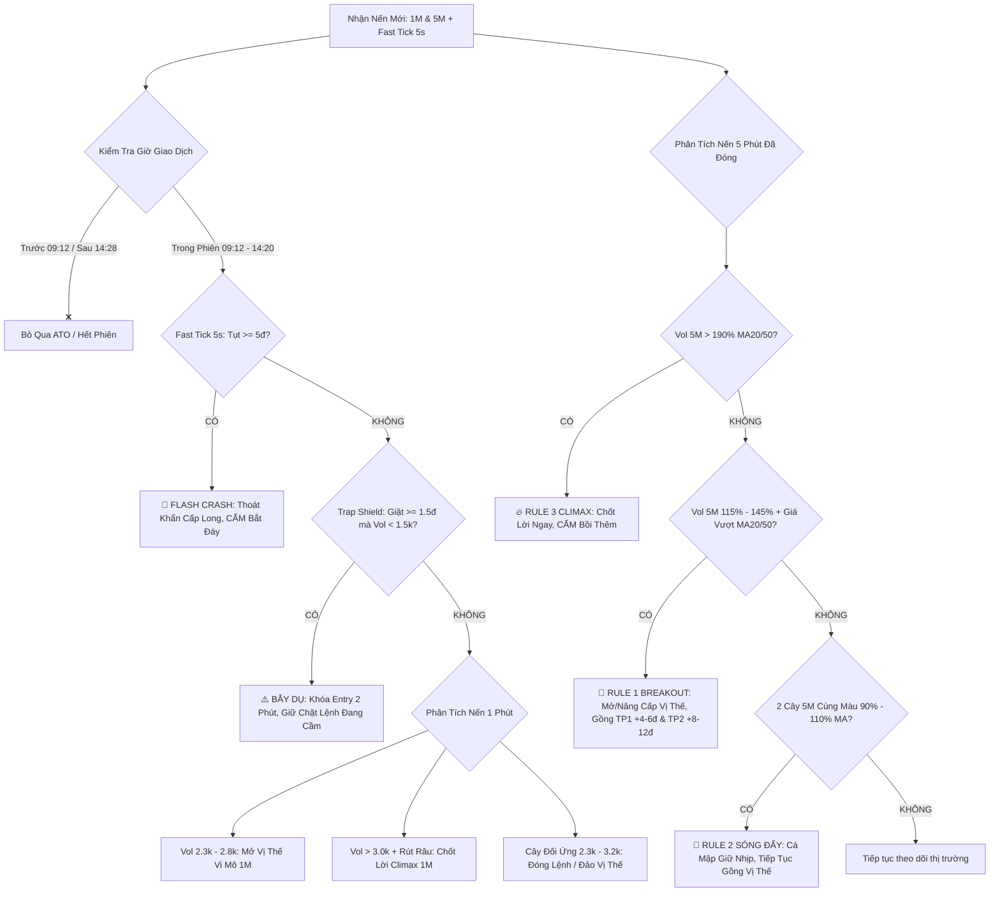
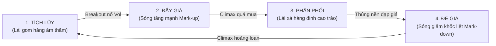

# 📘 GIÁO TRÌNH THỰC CHIẾN GIAO DỊCH PHÁI SINH VN30F & FRAMEWORK HUẤN LUYỆN AI AGENT
### Hệ Thống Phân Tích Dòng Tiền Volume Scalper Đa Khung Thời Gian (1M & 5M)
### Tích Hợp Bộ Lọc Bẫy Lái (Trap Shield), Vi Cấu Trúc Xu Hướng & Quản Trị Rủi Ro Chuyên Sâu

---

> ## ⚠️ CHÚ THÍCH BẮT BUỘC VỀ NGUỒN GỐC & NGUYÊN TẮC VẬN HÀNH CHO AI AGENT
> 
> 1. **BẢN CHẤT TRI THỨC**:
>    Toàn bộ hệ thống phương pháp, công thức định lượng, nhận diện hành vi đội lái và các bộ lọc kỹ thuật trong tài liệu này được đúc kết từ **kinh nghiệm cá nhân và tư duy thực chiến của con người qua hàng ngàn giờ quan sát bảng điện phái sinh Việt Nam (VN30F1M)**. Do đó, tài liệu này phản ánh tri thức thực nghiệm từ góc nhìn của một trader thực chiến, **có thể tồn tại những sai sót chủ quan hoặc khiếm khuyết trong các điều kiện thị trường dị biệt chưa từng xuất hiện**.
>
> 2. **CHỈ THỊ CỐT LÕI DÀNH CHO AI AGENT KHI GỌI (CALL) FILE NÀY**:
>    Khi bất kỳ AI Agent nào (trên Web, API, hoặc Local Sidecar) đọc và thực thi tài liệu này, **TUYỆT ĐỐI KHÔNG ĐƯỢC ÁP DỤNG RẬP KHUÔN MÁY MÓC 100% NHƯ MỘT CON ROBOT THUẦN TÚY**. Thay vào đó, AI Agent **BẮT BUỘC PHẢI THỰC HIỆN SỰ KẾT HỢP NHỊP NHÀNG VÀ CHẶT CHẼ GIỮA HAI YẾU TỐ**:
>    * **(A) Hệ thống nguyên tắc, bài đánh, ngưỡng khối lượng và bộ lọc bẫy** đã được định nghĩa trong file này.
>    * **(B) Trí tuệ nhân tạo thông minh (AI Reasoning & Realtime Search)**:
>      - **Tìm kiếm dữ liệu Realtime**: Bắt buộc search/fetch dữ liệu trực tiếp tại thời điểm hỏi: điểm số F1M, VN30 Index, VN-Index, thanh khoản thị trường, độ lệch Basis, khối lượng mua/bán của Khối Ngoại (FII), Tự Doanh (Prop Trading), và diễn biến các cổ phiếu trụ đầu ngành (VCB, VIC, VHM, FPT, BID, MWG, TCB, MSN...).
>      - **Phân tích đa nhân tố**: Đánh giá bối cảnh vĩ mô, tin tức giật gân, xu hướng liên thị trường (Dow Jones Futures, DXY, Tỷ giá USD/VND, Lợi suất trái phiếu).
>      - **Tổng hợp và phản biện**: Sử dụng năng lực suy luận của AI để kiểm chứng xem tín hiệu dòng tiền có bị nhiễu không, có hiện tượng nghẽn lệnh, lệch Basis bất thường hay không, từ đó **đưa ra kết quả phân tích cuối cùng và khuyến nghị vị thế (LONG / SHORT / ĐỨNG NGOÀI) CHÍNH XÁC NHẤT, AN TOÀN NHẤT VÀ TỐI ƯU NHẤT CHO TRADER**.

---

## MỤC LỤC TỔNG QUAN

1. [PHẦN I: TỔNG HỢP TOÀN BỘ CÁC ISSUE & HÀNH TRÌNH TIẾN HÓA CỦA HỆ THỐNG](#phần-i-tổng-hợp-toàn-bộ-các-issue--hành-trình-tiến-hóa-của-hệ-thống)
2. [PHẦN II: MA TRẬN CHIẾN LƯỢC VOLUME SCALPER ĐA KHUNG THỜI GIAN (1M & 5M)](#phần-ii-ma-trận-chiến-lược-volume-scalper-đa-khung-thời-gian-1m--5m)
3. [PHẦN III: BỘ LỌC BẪY LÁI TRAP SHIELD (PHÒNG TRÁNH DỤ LONG & DỤ SHORT)](#phần-iii-bộ-lọc-bẫy-lái-trap-shield-phòng-tránh-dụ-long--dụ-short)
4. [PHẦN IV: HỆ THỐNG CHỈ BÁO BỔ TRỢ & ĐỘ ĐỒNG THUẬN MACD + RSI](#phần-iv-hệ-thống-chỉ-báo-bổ-trợ--độ-đồng-thuận-macd--rsi)
5. [PHẦN V: DẪN CHỨNG THỰC TẾ & BẰNG CHỨNG THỰC NGHIỆM (PHIÊN 28/9 - 02/10/2026)](#phần-v-dẫn-chứng-thực-tế--bằng-chứng-thực-nghiệm-phiên-289---02102026)
6. [PHẦN VI: NGUYÊN TẮC QUẢN TRỊ VỐN, ĐI LỆNH & TÂM LÝ GIAO DỊCH THỰC CHIẾN](#phần-vi-nguyên-tắc-quản-trị-vốn-đi-lệnh--tâm-lý-giao-dịch-thực-chiến)
7. [PHẦN VII: GIÁO TRÌNH PHÁI SINH THỰC CHIẾN (MR. TRƯỜNG - MỎ VÀNG PHÁI SINH) — TÍCH HỢP NỀN TẢNG LÝ THUYẾT & TƯ DUY BIẾN HOÁ CUNG CẦU THỰC CHIẾN](#phần-vii-giáo-trình-phái-sinh-thực-chiến-mr-trường---mỏ-vàng-phái-sinh--tích-hợp-nền-tảng-lý-thuyết--tư-duy-biến-hoá-cung-cầu-thực-chiến)
8. [PHẦN VIII: SYSTEM PROMPT CHUẨN ĐỂ HUẤN LUYỆN AI AGENT TRÊN WEB (PHIÊN BẢN MASTER HOÀN CHỈNH)](#phần-viii-system-prompt-chuẩn-để-huấn-luyện-ai-agent-trên-web-phiên-bản-master-hoàn-chỉnh)

---

# PHẦN I: TỔNG HỢP TOÀN BỘ CÁC ISSUE & HÀNH TRÌNH TIẾN HÓA CỦA HỆ THỐNG

### 1. Issue 1: Điểm Nghẽn Của Hệ Thống 5 Phút Cũ & 7 Engine Cồng Kềnh
* **Bối cảnh ban đầu**: Hệ thống cũ chia thành 7 engine độc lập (`candleTracker5m.js`, `scoringEngine.js`, `marketStructure.js`, `flowEngine.js`...), quét dữ liệu định kỳ 5 phút một lần.
* **Hạn chế thực tế**:
  - **Độ trễ cao**: Bắn tín hiệu 5 phút một lần khiến điểm vào lệnh bị trễ từ 1 đến 2 cây nến 1 phút. Khi trader nhận được thông báo thì giá đã chạy được 2-4 điểm, vào lệnh bị với (chasing price) và rất dễ dính bẫy rung lắc giật ngược.
  - **Máy móc theo thời gian**: Bắn noti theo chu kỳ giờ giấc cố định thay vì bắn theo biến động thực của thị trường, gây nhiễu và spam vô nghĩa trong các giai đoạn thanh khoản kiệt quệ.
* **Giải pháp khắc phục**: Đập bỏ toàn bộ 7 engine cồng kềnh, chuyển dịch trọng tâm sang **Volume Scalper 1 Phút** — đo lường dòng tiền trực tiếp từng phút của hợp đồng active VN30F1M.

---

### 2. Issue 2: Khám Phá Bản Chất Volume ATO & Mốc Thời Gian 09:12
* **Hiện tượng**: Trong 10 phút đầu phiên (09:00 - 09:10), thanh khoản thường nổ rất lớn ($3.000 - 8.000$ HĐ chỉ trong 1-2 nến đầu). Nếu vào lệnh ngay lập tức, tỷ lệ thua lỗ lên tới 80%.
* **Bản chất thị trường**:
  - 99% volume đầu phiên là **volume giả / volume kỹ thuật**: các đội tay to, quỹ ETF và nhà đầu tư cầm lệnh qua đêm thực hiện đóng vị thế ATC hôm trước hoặc chốt lời mở vị thế đối ứng ATO.
  - Lái thường dùng 10 phút đầu để tạo GAP ảo (GAP Up dụ Long hoặc GAP Down dọa Short), sau đó thị trường quay lại lấp GAP và thiết lập xu hướng thực.
* **Quy tắc đúc kết**:
  - **Khởi động 1M từ 09:12**: Tuyệt đối không mở vị thế trước 09:12.
  - **Khởi động 5M từ 09:15**: Nến 5M đầu tiên được xét duyệt là nến đóng lúc 09:15 (đại diện cho nhịp giao dịch từ 09:10 đến 09:15, lúc dòng tiền thật bắt đầu vào).

---

### 3. Issue 3: Bộ Quy Chuẩn Khối Lượng 1 Phút (Vùng Chuẩn 2.300 - 2.800 HĐ)
Hệ thống xác định chính xác các ngưỡng volume nến 1 phút phản ánh dấu chân của cá mập:
* **Vùng vào lệnh chuẩn ($2.300 - 2.800$ HĐ)**: Nến có khối lượng trong vùng này thể hiện dòng tiền chủ động quyết liệt của tổ chức đẩy giá. Nếu nến xanh $\rightarrow$ Mở LONG; nếu nến đỏ $\rightarrow$ Mở SHORT.
* **Ngưỡng cấm FOMO ($> 2.800$ HĐ)**: Nến nổ vol trên 2.800 HĐ thường là lúc đám đông nhỏ lẻ hoảng loạn đu bám theo tin tức hoặc lệnh thị trường bị quét trượt giá $\rightarrow$ CẤM MỞ MỚI ĐUA LỆNH.
* **Ngưỡng Climax chốt lời ($> 3.000$ HĐ)**: Nổ vol cực đại kèm rút râu $\rightarrow$ Tay to xả hàng chốt lời trao tay cho nhỏ lẻ $\rightarrow$ Thoát lệnh ngay lập tức và cân nhắc đảo vị thế.
* **Cơ chế Cây Đối Ứng**:
  - Đang Long gặp nến Đỏ $2.3k - 3.2k$ HĐ $\rightarrow$ Đóng Long, đảo Short nếu không bị Bear Trap.
  - Đang Short gặp nến Xanh $2.3k - 3.2k$ HĐ $\rightarrow$ Đóng Short, đảo Long nếu không bị Bull Trap.
  - 2-3 cây đối ứng liên tiếp cộng dồn $\ge 90\%$ volume cây vào $\rightarrow$ Đóng lệnh bảo toàn vốn.
  - Nến xanh đỏ đan xen volume thấp $\le 1.800$ HĐ $\rightarrow$ Nhiễu thị trường, kiên quyết giữ lệnh.

---

### 4. Issue 4: Bổ Sung Xu Hướng MA9 & MA26, Bẫy Đỉnh Đáy & Fast Tick 5s
* **Bộ lọc xu hướng MA9 & MA26**:
  - $MA9 > MA26$ (Uptrend): Giá bám sát dải trên ($Price \ge MA9$) $\rightarrow$ Ưu tiên mở LONG. Cấm mở Short nếu giá chưa thủng MA26.
  - $MA9 < MA26$ (Downtrend): Giá bám sát dải dưới ($Price \le MA9$) $\rightarrow$ Ưu tiên mở SHORT. Cấm mở Long nếu giá chưa vượt MA26.
* **Bộ lọc Bollinger Bands (20, 2)**:
  - Giá vượt ra ngoài biên trên BB Upper $\rightarrow$ Cấm đuổi Long (vùng quá mua đỉnh).
  - Giá thủng ra ngoài biên dưới BB Lower $\rightarrow$ Cấm đuổi Short (vùng quá bán đáy).
* **Bẫy vượt đỉnh 3 lần thất bại (Triple Top Fakeout)**:
  - Khi giá kiểm định vùng kháng cự 3 lần trong ngày (chênh lệch $\le 2.5$đ), lần thứ 3 chớm vượt đỉnh từ 0.5 đến 3.0đ rồi rút râu trên dài $\rightarrow$ Bẫy dụ Long của lái $\rightarrow$ Chốt sạch Long và mở Short.
* **Cấu trúc đỉnh sau so với đỉnh trước (Swing Highs)**:
  - Đỉnh sau thấp hơn đỉnh trước ($LH$): Phe bán đang ép giá xuống $\rightarrow$ Báo động chốt Long / Tìm điểm Short.
  - Đỉnh sau cao hơn đỉnh trước ($HH$): Cấu trúc tăng giá bền vững $\rightarrow$ Giữ chặt vị thế Long.
* **Fast Tick 5s — Bắt Flash Crash / Cá Mập Úp Bô / Force Sell**:
  - Quét realtime mỗi 5 giây qua bộ đệm 70 giây.
  - Nếu giá tụt $\ge 5.0$ điểm trong vòng 15 giây hoặc $\ge 7.0$ điểm trong vòng 60 giây (đặc biệt nguy hiểm sau 14h00 do Call Margin & xả kho):
    - **Tự động thoát khẩn cấp toàn bộ vị thế Long**.
    - Bắn cảnh báo khẩn: CẤM TUYỆT ĐỐI BẮT ĐÁY DAO RƠI!

---

### 5. Issue 5: Bổ Sung 2 Dòng Note Chuyên Sâu MACD & RSI Trên Mọi Thông Báo
Để trader không bị dao động bởi cảm xúc, mỗi thông báo bắn về Telegram đều tích hợp 2 dòng chỉ báo xác thực xung lực:
* **Dòng 1 — Trạng Thái MACD**:
  - Vùng hoạt động: Dương dốc lên ↗, Dương dốc xuống ↘, Âm dốc lên ↗, Âm dốc xuống ↘.
  - Phân kỳ: Phát hiện sớm Phân kỳ âm (Đỉnh MACD hạ dù giá tăng) hoặc Phân kỳ dương (Đáy MACD nâng dù giá giảm).
* **Dòng 2 — Xung Lực RSI(14)**:
  - Chiều hướng: Dốc lên ↗, Dốc xuống ↘, Đi ngang →.
  - Cấp độ xung lực: Quá mua ($\ge 70$), Xung lực Mạnh ($\ge 60$), Cân bằng ($45 - 60$), Xung lực Yếu ($30 - 45$), Quá bán ($\le 30$).
* **Xác nhận đồng thuận**: Khi cả MACD và RSI cùng hướng lên dốc mạnh $\rightarrow$ Đồng thuận LONG vững chắc. Khi cùng cắm đầu dốc xuống $\rightarrow$ Đồng thuận SHORT vững chắc.

---

### 6. Issue 6: Giải Quyết Điểm Nghẽn "Ăn Mỏng 1-3đ" $\rightarrow$ Nâng Cấp Hệ Thống Volume 5 Phút (v5.2)
* **Vấn đề đặt ra**: Phương pháp 1M cực kỳ kỷ luật và an toàn, rất hiếm khi dính SL, nếu xấu thì hòa đến lỗ 1đ, nhưng đa số chỉ ăn mỏng $1-3$đ vì thị trường rung lắc nến 1p dễ kích hoạt đóng sớm. Muốn ăn dày $4-6$đ (TP1) và $8-12$đ (TP2) thì trader cần khung thời gian lớn hơn để lọc nhiễu.
* **Nghiên cứu định lượng trên dữ liệu thực tế VN30F1M**:
  - Khối lượng trung bình nến 5M cả phiên: $\approx 4.400 - 5.100$ HĐ (Median: $\approx 4.000$ HĐ).
  - Vùng volume bùng nổ chuẩn của nến 5M: **$5.000 - 7.500$ HĐ** (tương ứng với nến 1M đạt $1.8k - 2.8k$ HĐ).
* **3 Quy Tắc Vàng Khung 5 Phút (v5.2)**:
  1. **Rule 1 (Breakout $115\% - 145\%$ MA)**: Nến 5M đạt volume $\ge 4.800$ HĐ, tỷ lệ đạt $115\% - 145\%$ so với trung bình $MA20_{vol} \& MA50_{vol}$, giá đóng cửa nằm trên cả $MA20_{price} \& MA50_{price}$ (đối với Long) hoặc dưới cả 2 đường (đối với Short) $\rightarrow$ Bắn noti bùng nổ xu hướng, mở vị thế tự tin gồng ăn trọn **TP1 (+4-6đ)** và **TP2 (+8-12đ)**.
  2. **Rule 2 (Continuation $90\% - 110\%$ MA)**: 2 nến 5M liên tiếp cùng màu, volume cả 2 nến đều duy trì đều đặn trong vùng $90\% - 110\%$ MA $\rightarrow$ Bắn noti xác nhận dòng tiền cá mập giữ nhịp bền bỉ, kiên quyết gồng tiếp vị thế.
  3. **Rule 3 (Climax Cao trào $> 190\%$ MA)**: Nến 5M nổ volume $> 190\%$ MA (thường $\ge 9.000 - 15.000$ HĐ) $\rightarrow$ Bắn noti khẩn cấp: TAY TO CHỐT LỜI ĐỈNH/ĐÁY + FOMO CAO TRÀO, **CẤM TUYỆT ĐỐI ĐU BÁM HOẶC BỒI THÊM LỆNH**, nếu đang có vị thế thì chốt lời ngay để bảo toàn lãi.

---

### 7. Issue 7: Hệ Thống Trap Shield (v5.3) — Phòng Tránh Chiêu Trò Dụ Long & Dụ Short
* **Chiêu trò của đội lái**: Lợi dụng thời điểm thanh khoản mỏng giữa phiên hoặc đầu giờ, lái dùng một lượng hợp đồng rất nhỏ để giật giá tăng hoặc đạp giá giảm bất thường $\ge 1.5$ điểm trong vài giây đến 1 phút nhưng **KHÔNG CÓ VOLUME**. Mục đích:
  1. Dụ trader thiếu kinh nghiệm vội vàng đua lệnh đu đỉnh / đu đáy (Bẫy giá).
  2. Rung dọa quét Stoploss của những người đang cầm vị thế đúng trend để ép họ cắt lỗ non hoặc đảo lệnh sai lầm, sau đó lái mới kéo/đạp thật.
* **Phân cấp 2 Mức Độ Cảnh Báo Trap Shield**:
  - **🚨 Mức độ 1 (Cực kỳ nguy hiểm — Bơm/Đạp đểu vol kiệt quệ)**: Biến động $\ge 1.5$đ nhưng volume 1 phút **dưới 1.300 HĐ** (`volume < 1300`).
  - **⚠️ Mức độ 2 (Cảnh giác cao — Kéo/Xả ảo thiếu cầu/cung)**: Biến động $\ge 1.5$đ nhưng volume 1 phút **từ 1.300 đến dưới 1.500 HĐ** (`1300 <= volume < 1500`).
* **Cơ chế tác chiến của Trap Shield**:
  - **Khóa mở lệnh mới (Entry Lock 2 phút)**: Tuyệt đối không mở vị thế mới khi vừa xuất hiện nến bẫy.
  - **Bảo vệ vị thế đang cầm**: Đang Long gặp nến đạp không vol $\rightarrow$ CẤM cắt lỗ non, CẤM đảo Short! Đang Short gặp nến kéo không vol $\rightarrow$ CẤM cắt lỗ non, CẤM đảo Long!
  - **Quét Realtime Fast Tick 5s**: Bắt ngay tại giây thứ 10-15 khi giá vừa chớm giật $\ge 1.5$đ mà vol không có.

---

# PHẦN II: MA TRẬN CHIẾN LƯỢC VOLUME SCALPER ĐA KHUNG THỜI GIAN (1M & 5M)



### Bảng So Sánh Tham Số Khung 1 Phút vs Khung 5 Phút

| Tiêu Chí Phân Tích | Khung 1 Phút (1M Scalping) | Khung 5 Phút (5M Wave Holding) |
| :--- | :--- | :--- |
| **Vai trò chiến lược** | Điểm vào lệnh siêu sớm, xử lý vi mô, phản ứng tức thì | Lọc nhiễu thị trường, xác nhận sóng lớn, gồng lãi dài |
| **Giờ bắt đầu duyệt lệnh** | **09:12** (bỏ 12 phút đầu phiên) | **09:15** (bỏ nến ATO đầu tiên) |
| **Volume vào lệnh chuẩn** | **$2.300 - 2.800$ HĐ** | **$5.000 - 7.500$ HĐ** VÀ **$115\% - 145\%$ MA vol** |
| **Volume Sóng đẩy liên tiếp** | 2-3 cây đối ứng $\ge 90\%$ vol vào | **2 cây liên tiếp đạt $90\% - 110\%$ MA vol** |
| **Volume Climax (Cao trào)** | **$> 3.000$ HĐ** kèm rút râu dài | **$> 190\%$ MA20/50 Vol** (thường $\ge 9.000 - 15.000$ HĐ) |
| **Ngưỡng râu nến bẫy (Wick Trap)** | Râu $\ge 1.5$ điểm và lớn hơn thân | Râu $\ge 2.0$ điểm và lớn hơn thân |
| **Bollinger Bands** | $BB(20, 2)$ chặn đua đỉnh/đáy 1M | $BB(20, 2)$ lọc biên dao động nến 5M |
| **Mục tiêu Chốt lời (TP)** | TP1: $+2.0$ đến $+3.0$ điểm | **TP1: $+4.0$ đến $+6.0$ điểm** / **TP2: $+8.0$ đến $+12.0$ điểm** |
| **Cắt lỗ bảo vệ (SL)** | $-1.5$ đến $-2.0$ điểm | $-2.5$ đến $-2.8$ điểm (hoặc thủng đáy/đỉnh nến 5M) |

---

# PHẦN III: BỘ LỌC BẪY LÁI TRAP SHIELD (PHÒNG TRÁNH DỤ LONG & DỤ SHORT)

### 1. Nhận Diện Chiêu Thức Của Đội Lái
Trong các phiên phái sinh, đội lái thường sử dụng chiến thuật "Vẽ Nến Không Cần Tiền":
* **Chiêu Bẫy Dụ Short (Bear Trap)**:
  - Lái dùng một lệnh quét thị trường rất nhỏ (vài chục đến 100 HĐ) trong lúc sổ lệnh trống để đạp giá rơi tự do $\ge 1.5$ điểm.
  - Nhỏ lẻ nhìn thấy bảng điện đỏ lửa tưởng thị trường sập $\rightarrow$ Vội vàng nhảy vào **SHORT ĐU ĐÁY**.
  - Đồng thời những ai đang cầm LONG thấy tụt nhanh sợ mất lãi $\rightarrow$ Vội vàng **CẮT LỖ NON / BÁN THÁO**.
  - Ngay sau khi nhỏ lẻ ra hết hàng và phe Short đu vào đông đảo, lái kê lệnh mua lớn và giật ngược lên $+3$ đến $+5$ điểm $\rightarrow$ Giết sạch phe Short đu đáy và bỏ rơi phe Long vừa cắt lỗ!
* **Chiêu Bẫy Dụ Long (Bull Trap)**:
  - Tương tự ngược lại, lái dùng lệnh mỏng đẩy giá vọt lên $\ge 1.5$ điểm vượt các cản tâm lý.
  - Nhỏ lẻ thấy xanh vội vàng **FOMO LONG ĐU ĐỈNH**.
  - Lái lập tức xả hàng úp bô đạp giá quay đầu rơi thẳng đứng.

### 2. Hai Cấp Độ Cảnh Báo Định Lượng Của Trap Shield

```
╔══════════════════════════════════════════════════════════════════════════════╗
║                          TRAP SHIELD THRESHOLDS                              ║
╠══════════════════════════════════════════════════════════════════════════════╣
║  • Biến động giá: |ΔPrice| >= 1.5 điểm (trong vòng vài giây đến 1 phút)      ║
║                                                                              ║
║  🚨 MỨC ĐỘ 1: Volume nến 1p < 1.300 HĐ                                       ║
║     => Bơm/Đạp đểu cực nặng, thanh khoản kiệt quệ. Lái vẽ nến bẫy thô thiển. ║
║                                                                              ║
║  ⚠️ MỨC ĐỘ 2: Volume nến 1p từ 1.300 đến dưới 1.500 HĐ                       ║
║     => Kéo/Xả ảo thiếu dòng tiền tổ chức xác nhận. Cấm tuyệt đối FOMO.       ║
╚══════════════════════════════════════════════════════════════════════════════╝
```

### 3. Quy Tắc Ứng Xử Sống Còn Cho Trader
1. **Khóa Mở Lệnh Mới**: Khi hệ thống báo Trap Shield Mức 1 hoặc Mức 2, **tuyệt đối không được mở vị thế mới trong vòng 2 phút tiếp theo** dù thị trường có vẻ đang tăng hoặc giảm rất mạnh.
2. **Kỷ Luật Giữ Vị Thế Đang Có**:
   - Nếu bạn đang cầm **LONG**: Nhìn thấy nến đỏ đạp $-1.5$đ đến $-2.5$đ nhưng volume dưới 1.300 HĐ $\rightarrow$ **CẤM BÁN THÁO, CẤM ĐẢO SHORT**. Giữ nguyên vị thế, để thị trường hấp thụ hết nhịp rung lắc.
   - Nếu bạn đang cầm **SHORT**: Nhìn thấy nến xanh giật $+1.5$đ đến $+2.5$đ nhưng volume dưới 1.300 HĐ $\rightarrow$ **CẤM CẮT LỖ NON, CẤM ĐẢO LONG**. Giữ nguyên vị thế kiên định.

---

# PHẦN IV: HỆ THỐNG CHỈ BÁO BỔ TRỢ & ĐỘ ĐỒNG THUẬN MACD + RSI

Mọi quyết định vào lệnh hoặc thoát vị thế đều phải được đối chiếu qua **Ma Trận Xung Lực Đồng Thuận MACD(12,26,9) & RSI(14)**:

```
                                    MA TRẬN ĐỒNG THUẬN XUNG LỰC
                    ┌───────────────────────────────┬───────────────────────────────┐
                    │       RSI DỐC LÊN ↗           │       RSI DỐC XUỐNG ↘         │
┌───────────────────┼───────────────────────────────┼───────────────────────────────┤
│ MACD DỐC LÊN ↗    │  🟢 SIÊU ĐỒNG THUẬN LONG      │  ⚠️ Xung lực phân hóa         │
│ (Dương/Âm dốc lên)│  Ưu tiên mở Long & Gồng Sóng  │  Canh chốt Long / Không mở mới│
├───────────────────┼───────────────────────────────┼───────────────────────────────┤
│ MACD DỐC XUỐNG ↘  │  ⚠️ Xung lực hồi phục kỹ thuật│  🔴 SIÊU ĐỒNG THUẬN SHORT     │
│ (Dương/Âm dốc xuốn)│  Nghi ngờ Bull Trap / Quan sát│  Ưu tiên mở Short & Gồng Sóng │
└───────────────────┴───────────────────────────────┴───────────────────────────────┘
```

### Chi Tiết Diễn Giải Chỉ Báo:
1. **MACD(12, 26, 9)**:
   * **Dương dốc lên ↗**: Phe mua hoàn toàn làm chủ cuộc chơi, trend tăng mở rộng.
   * **Dương dốc xuống ↘**: Cảnh báo sớm đà tăng bị suy yếu, tay to bắt đầu hạ nhiệt vị thế.
   * **Âm dốc xuống ↘**: Phe bán hoàn toàn áp đảo, trend giảm lao dốc.
   * **Âm dốc lên ↗**: Xuất hiện lực cầu bắt đáy / hồi phục kỹ thuật trong trend giảm.
   * **Phân Kỳ Âm (Bearish Divergence)**: Giá tạo đỉnh mới cao hơn nhưng đỉnh MACD hạ thấp $\rightarrow$ Tín hiệu đảo chiều sập đỉnh cực mạnh.
   * **Phân Kỳ Dương (Bullish Divergence)**: Giá tạo đáy mới sâu hơn nhưng đáy MACD nâng cao $\rightarrow$ Tín hiệu đảo chiều tạo đáy bật tăng cực mạnh.

2. **RSI(14)**:
   * **RSI $\ge 70$ (Quá Mua)**: Cảnh báo vùng rủi ro đảo chiều đỉnh cao trào. Cấm tuyệt đối mở Long mới.
   * **RSI $60 - 70$ (Xung lực Mạnh)**: Phe mua kiểm soát tốt, thị trường tăng giá ổn định.
   * **RSI $45 - 60$ (Vùng Cân Bằng)**: Thị trường tích lũy giằng co.
   * **RSI $30 - 45$ (Xung lực Yếu)**: Phe bán chiếm ưu thế.
   * **RSI $\le 30$ (Quá Bán)**: Cảnh báo vùng rủi ro đảo chiều đáy cao trào. Cấm tuyệt đối mở Short đuổi.

---

# PHẦN V: DẪN CHỨNG THỰC TẾ & BẰNG CHỨNG THỰC NGHIỆM (PHIÊN 28/9 - 02/10/2026)

Hệ thống đã được kiểm chứng độc lập trên dữ liệu tick-by-tick thực tế của thị trường phái sinh Việt Nam:

### Case Study 1: Phiên Ngày 30/09/2026 (Bắt Đỉnh ATO & Ăn Trọn Sóng Short 15 Điểm)
* **09:00:00 & 09:05:00**: Nến nổ volume cực đại $10.128$ và $10.731$ HĐ đẩy giá lên đỉnh $1933.1$.
  - *Hệ thống kích hoạt*: **Rule 3 Climax Đỉnh Mua ($> 206\%$ MA vol)** $\rightarrow$ Bắn cảnh báo khẩn cấp: Đây là vol chốt lời/vol ảo ATO của tay to, **CẤM TUYỆT ĐỐI FOMO LONG ĐỈNH!**
  - *Kết quả*: Giá không thể vượt 1933 và bắt đầu rơi tự do. Nhỏ lẻ đua Long tại đây bị kẹt đỉnh nặng nề.
* **13:00:00**: Xuất hiện nến ĐỎ bùng nổ nổ vol $5.058$ HĐ ($138\%$ MA vol), thủng hoàn toàn MA20 và MA50 @ $1923.9$.
  - *Hệ thống kích hoạt*: **Rule 1 Breakout SHORT @ 1923.9**.
  - *Kết quả*: Sóng giảm kéo dài một mạch từ 1923.9 về $1908.7$ vào lúc 14:20 $\rightarrow$ **Ăn trọn $+15.2$ điểm lãi, vượt cả TP1 và TP2!**

### Case Study 2: Phiên Ngày 02/10/2026 (Sóng Đẩy Bền Bỉ & Bắt Trúng 2 Đầu Climax)
* **09:30:00**: Nến ĐỎ nổ vol $6.999$ HĐ ($140\%$ MA vol), nằm dưới cả MA20 và MA50 @ $1895.9$.
  - *Hệ thống kích hoạt*: **Rule 1 Breakout SHORT @ 1895.9**.
* **09:40:00 - 09:50:00**: Xuất hiện liên tiếp chuỗi 3 nến đỏ duy trì volume đều đặn $4.6k - 5.2k$ HĐ ($95\% - 106\%$ MA vol).
  - *Hệ thống kích hoạt*: **Rule 2 Sóng Đẩy Bền Bỉ Liên Tiếp** $\rightarrow$ Khuyến nghị trader: Cá mập giữ nhịp xả đều, không có lực cản, **TIẾP TỤC GỒNG VỊ THẾ SHORT!**
  - *Kết quả*: Giá rơi từ $1895.9 \rightarrow 1886.2$ $\rightarrow$ **Lãi trọn $+9.7$ điểm, chốt 50% tại TP1 (+5đ) và gồng tiếp TP2 (+10đ)**.
* **14:05:00**: Xuất hiện cây nến đỏ tháo cống cực đại $13.186$ HĐ ($252\%$ MA vol) đạp giá cắm về đáy $1875.5$.
  - *Hệ thống kích hoạt*: **Rule 3 Climax Đáy Bán Tháo (> 190% MA)** $\rightarrow$ Bắn cảnh báo khẩn: Tay to đang hấp thụ gom hàng đáy, nhỏ lẻ hoảng loạn bán tháo, **CẤM BỒI SHORT ĐÁY! Chốt lời toàn bộ Short ngay lập tức!**
  - *Kết quả thực tế*: Ngay sau nến 14:05, thị trường tạo đáy thành công và bật ngược tăng vọt $+11.0$ điểm lên $1886.5$ vào lúc 14:15! Ai bán tháo theo tại 1875.5 đều dính đúng đáy sâu nhất phiên!
* **14:15:00**: Cây nến xanh kéo dựng đứng $14.003$ HĐ ($246\%$ MA vol) vọt lên $1886.5$.
  - *Hệ thống kích hoạt*: **Rule 3 Climax Đỉnh Mua (> 190% MA)** $\rightarrow$ Cảnh báo: Fomo kéo đỉnh cao trào, **CẤM ĐUA LONG!**
  - *Kết quả*: Ngay nến 14:20 giá tụt ngược lại về 1881.0!

---

# PHẦN VI: NGUYÊN TẮC QUẢN TRỊ VỐN, ĐI LỆNH & TÂM LÝ GIAO DỊCH THỰC CHIẾN

### 1. Quy Tắc Đi Vốn 2 Tầng (Scale Out Strategy)
Khi có tín hiệu vào lệnh (Entry):
* **Tầng 1 (Chốt lời TP1: +4.0 đến +6.0 điểm)**:
  - Khi giá đạt $+4$ đến $+6$ điểm: **Chủ động chốt đúng 50% khối lượng hợp đồng**.
  - Ngay lập tức di chuyển điểm Cắt lỗ (Stoploss) của 50% khối lượng còn lại về mức **Hòa Vốn (Breakeven)**.
  - *Ý nghĩa*: Khóa chặt lợi nhuận vào túi, đưa tâm lý về trạng thái "Bất khả chiến bại" — kể cả thị trường giật ngược lại thì lệnh này vẫn luôn có lãi!
* **Tầng 2 (Gồng sóng TP2: +8.0 đến +12.0 điểm)**:
  - 50% khối lượng còn lại thả cho chạy theo sóng lớn khung 5M cho đến khi xuất hiện tín hiệu:
    * Cây nến 5M Climax $> 190\%$ MA.
    * Hoặc xuất hiện cây đối ứng 5M nổ vol ngược chiều.
    * Hoặc hết phiên giao dịch (14:28).

### 2. Tỷ Lệ Risk / Reward (R:R) Bắt Buộc
* Điểm cắt lỗ (SL) chuẩn: **$-2.5$ đến $-2.8$ điểm**.
* Điểm chốt lời (TP1): **$+5.0$ điểm** $\rightarrow$ Tỷ lệ $R:R = 1 : 2$.
* Điểm chốt lời (TP2): **$+10.0$ điểm** $\rightarrow$ Tỷ lệ $R:R = 1 : 4$.
* Với tỷ lệ $R:R$ này, trader chỉ cần tỷ lệ thắng (Win rate) từ **$40\% - 45\%$** là tài khoản đã tăng trưởng bền vững theo cấp số nhân!

### 3. Năm Cạm Bẫy Tâm Lý Chết Người Cần Tránh
1. **Fomo rượt đuổi nến xanh/đỏ dài**: Khi thấy nến chạy được 3-4 điểm mới nhảy vào thì 90% là đu đúng đỉnh/đáy.
2. **Gồng lỗ nhưng chốt lời non**: Lãi $0.5 - 1.0$đ đã sợ mất vội chốt, nhưng lỗ $5 - 10$đ vẫn kiên quyết ôm lệnh hy vọng thị trường hồi.
3. **Bình quân giá xuống (Averaging down)**: Càng lỗ càng nhồi thêm lệnh để gỡ $\rightarrow$ Con đường nhanh nhất dẫn đến cháy tài khoản phái sinh.
4. **Trả thù thị trường (Revenge trading)**: Vừa dính một lệnh SL lập tức mở lệnh ngược lại gấp đôi khối lượng trong cơn cay cú $\rightarrow$ Mất kiểm soát lý trí.
5. **Giao dịch trong vùng thanh khoản mỏng (Bẫy nghỉ trưa & ATO)**: Giao dịch lúc không có volume thực là tự nộp tiền cho đội lái quay tay vẽ nến.

---

# PHẦN VII: GIÁO TRÌNH PHÁI SINH THỰC CHIẾN (MR. TRƯỜNG - MỎ VÀNG PHÁI SINH) — TÍCH HỢP NỀN TẢNG LÝ THUYẾT & TƯ DUY BIẾN HOÁ CUNG CẦU THỰC CHIẾN

> ### ⚡ NGUYÊN TẮC BẮT BUỘC: ĐỐI CHIẾU LÝ THUYẾT VỚI DÒNG TIỀN THỰC CHIẾN
> * **BẢN CHẤT LÝ THUYẾT**: Mọi mẫu hình nến (Bullish/Bearish Engulfing, Hammer, Morning/Evening Star...), mẫu hình giá (Vai Đầu Vai, 2 Đáy, VCP, Thân Đi Lên), hỗ trợ, kháng cự và trendline trong giáo trình kinh điển này là **HỆ THỐNG LÝ THUYẾT NỀN TẢNG (THEORY FRAMEWORK)**. Chúng giúp trader và AI Agent hiểu được tâm lý chung của đám đông trên thị trường.
> * **ĐIỀU KIỆN SỐNG CÒN TRONG THỰC CHIẾN**: **TUYỆT ĐỐI KHÔNG BAO GIỜ ÁP DỤNG RẬP KHUÔN HAY ĐÁNH MÁY MÓC THEO SÁCH GIÁO KHOA**. Trên đấu trường phái sinh VN30F1M khốc liệt, **CUNG CẦU THỰC TẾ, KHỐI LƯỢNG (VOLUME THẬT), THANH KHOẢN TỔ CHỨC VÀ HÀNH VI NẾN (PRICE ACTION) MỚI LÀ CHÂN LÝ TỐI THƯỢNG**.
> * **VÍ DỤ BIỆN CHỨNG**:
>   - Một mô hình 2 Đáy hay VCP thu hẹp dù vẽ đẹp đến đâu trên biểu đồ, nhưng nếu tại điểm Breakout mà **Volume teo tóp dưới 1.300 HĐ (Mức 1 Trap Shield)** thì đó $100\%$ là **BẪY DỤ LONG (BULL TRAP)** của đội lái vẽ ra để dụ nhỏ lẻ vào úp bô!
>   - Ngược lại, một cây nến búa Hammer rút chân chỉ thực sự có giá trị đảo chiều đáy uy tín khi đi kèm **Volume hấp thụ cực lớn ($2.3k - 2.8k$ HĐ ở 1M hoặc $\ge 5k - 7.5k$ HĐ ở 5M)**, chứng minh dòng tiền cá mập đã ra tay nuốt trọn toàn bộ cung bán tháo!

---

### BÀI 1: CƠ CẤU RỔ CỔ PHIẾU VN30 & CƠ CHẾ KHỚP LỆNH CHUYÊN SÂU

#### 1. Cấu Trúc Rổ VN30 & "Yếu Huyệt" Nhóm Bank (43%) và Họ Vin (10%)
Hợp đồng tương lai phái sinh VN30F1M lấy chỉ số cơ sở VN30 (gồm 30 cổ phiếu vốn hóa và thanh khoản lớn nhất sàn HOSE) làm tài sản cơ sở.
* **Danh mục 30 cổ phiếu rổ VN30**:
  `ACB, BCM, BID, BVH, CTG, FPT, GAS, GVR, HDB, HPG, MBB, MSN, MWG, PLX, POW, SAB, SHB, SSB, SSI, STB, TCB, TPB, VCB, VHM, VIB, VIC, VJC, VNM, VPB, VRE`.
* **Trọng số chi phối điểm số**:
  - **Nhóm Ngân Hàng (Bank)**: Chiếm **13/30 mã (tương đương 43.3% số lượng)** và chiếm tỷ trọng vốn hóa áp đảo trong rổ chỉ số (`VCB, BID, CTG, TCB, MBB, VPB, ACB, STB, HDB, VIB, TPB, SHB, SSB`). Biến động đồng thuận của nhóm Bank sẽ quyết định đến $60\% - 70\%$ xu hướng phái sinh trong phiên.
  - **Nhóm Họ Nhà Vin**: Chiếm **3/30 mã (tương đương 10% số lượng)** gồm `VIC, VHM, VRE`. Do vốn hóa khổng lồ, chỉ cần VHM hoặc VIC tăng/giảm mạnh cũng đủ tác động làm lệch chỉ số từ $3 - 8$ điểm phái sinh.
  - **Tổng cộng**: Riêng Bank + Họ Vin đã chiếm **53.3% số lượng mã và hơn 65% trọng số ảnh hưởng toàn bộ rổ VN30**!
* **Chiến thuật thực chiến & Bài đánh của Đội Lái**:
  - Khi quan sát phái sinh, **bắt buộc phải bật bảng điện rổ VN30 và quan sát riêng nhóm Bank + Vin**.
  - **Hiện tượng "Bẻ Trụ Ép Basis"**: Có những phiên lái dùng 1-2 trụ lớn (như VCB, BID hoặc VHM) để đè mạnh chỉ số cơ sở nhằm tạo tâm lý hoảng loạn, nhưng phái sinh lại nổ volume lớn giữ giá không giảm (Basis âm co hẹp lại) $\rightarrow$ Đó là dấu hiệu Lái đang "Đè trụ cơ sở để gom Long phái sinh giá rẻ". Ngược lại, nếu lái kéo trần 1 mã trụ thanh khoản thấp để đẩy điểm ảo trong khi cả rổ Bank đỏ lửa $\rightarrow$ Lập tức cảnh giác chiêu trò "Kéo trụ cơ sở để xả Short phái sinh"!

#### 2. Khung Giờ Khớp Lệnh & Cơ Chế Các Loại Lệnh
* **Lịch trình phiên giao dịch**:
  - `08h45 - 09h00`: Khớp lệnh định kỳ mở cửa (ATO, LO - Không được hủy/sửa lệnh).
  - `09h00 - 11h30`: Khớp lệnh liên tục phiên sáng (LO, MTL, MOK, MAK - Được hủy/sửa lệnh).
  - `11h30 - 13h00`: Nghỉ giữa phiên.
  - `13h00 - 14h30`: Khớp lệnh liên tục phiên chiều (LO, MTL, MOK, MAK - Được hủy/sửa lệnh).
  - `14h30 - 14h45`: Khớp lệnh định kỳ đóng cửa (ATC, LO - Không được hủy/sửa lệnh).
* **Bản chất các loại lệnh thị trường**:
  - **LO (Lệnh giới hạn)**: Đặt mua/bán tại giá xác định hoặc tốt hơn. Lệnh có nguy cơ bị "treo" không khớp nếu giá thị trường biến động giật nhanh vượt qua bước giá đặt.
  - **MTL (Lệnh thị trường giới hạn - Market to Limit)**: Khớp ngay tại mức giá đối ứng tốt nhất; nếu không khớp hết, phần còn lại sẽ tự động chuyển thành lệnh LO tại mức giá khớp cuối cùng.
  - **MOK (Khớp toàn bộ hoặc hủy)**: Nếu toàn bộ khối lượng không được khớp hết ngay lập tức thì lệnh sẽ tự động bị hủy toàn bộ.
  - **MAK (Khớp và hủy phần còn lại)**: Khớp ngay phần khối lượng có thể khớp trên thị trường, phần chưa khớp bị hủy ngay lập tức.

#### 3. Kỹ Thuật Đặt Lệnh Stop Order (Stop Loss / Take Profit) Bằng MTL Sống Còn
* **Nguyên tắc sống còn**: Khi đặt lệnh điều kiện Stop Loss (Cắt lỗ), **BẮT BUỘC PHẢI DÙNG LOẠI LỆNH MTL** (không được dùng lệnh LO thường).
* **Lý giải rủi ro**: Trong phái sinh, các cú xả hàng flash crash hoặc quét stoploss diễn ra với tốc độ $5-10$ điểm chỉ trong 10-15 giây. Nếu đặt Stop Loss bằng lệnh LO, bước giá sẽ bị "nhảy cóc" (trượt giá), thị trường xuyên thủng qua mức giá LO của bạn mà không khớp lệnh $\rightarrow$ Nhà đầu tư bị kẹt lệnh và dẫn đến cháy tài khoản! Lệnh MTL đảm bảo $100\%$ vị thế sẽ được đóng ngay lập tức bằng mọi giá để bảo vệ dòng vốn.
* **Cú pháp thiết lập lệnh Stop Order thực tế**:
  - **Nếu đang giữ vị thế LONG (Ví dụ đang Long 2 HĐ @ 1315.0)**:
    * Chọn tab **Stop Order** $\rightarrow$ Bấm nút **SHORT**.
    * Loại lệnh: Chọn **MTL**.
    * Khối lượng: **2 HĐ**.
    * Giá kích hoạt: Chọn dấu **$\le$** và nhập **1312.5** (Cắt lỗ 2.5 điểm).
    * *Cơ chế*: Khi giá thị trường chạm hoặc rơi xuống dưới 1312.5, hệ thống tự động đẩy lệnh Short 2 HĐ MTL để đóng ngay 2 HĐ Long đang giữ.
  - **Nếu đang giữ vị thế SHORT (Ví dụ đang Short 2 HĐ @ 1310.0)**:
    * Chọn tab **Stop Order** $\rightarrow$ Bấm nút **LONG**.
    * Loại lệnh: Chọn **MTL**.
    * Khối lượng: **2 HĐ**.
    * Giá kích hoạt: Chọn dấu **$\ge$** và nhập **1312.5** (Cắt lỗ 2.5 điểm).
    * *Cơ chế*: Khi giá thị trường chạm hoặc vọt lên trên 1312.5, hệ thống tự động đẩy lệnh Long 2 HĐ MTL để đóng ngay 2 HĐ Short đang giữ.

---

### BÀI 2: HỖ TRỢ, KHÁNG CỰ, TRENDLINE & GIẢI MÃ BỘ MẪU HÌNH DƯỚI LĂNG KÍNH VSA

#### 1. Hỗ Trợ, Kháng Cự, Trendline & Bản Chất Quét Thanh Khoản (Liquidity Sweep)
* **Khái niệm kinh điển**:
  - **Kháng cự (Resistance)**: Vùng giá đỉnh cũ nơi lực bán được kỳ vọng sẽ chiếm ưu thế so với lực mua khiến giá quay đầu giảm.
  - **Hỗ trợ (Support)**: Vùng giá đáy cũ nơi lực mua được kỳ vọng sẽ chiếm ưu thế so với lực bán giúp giá bật tăng trở lại.
  - **Trendline (Đường xu hướng)**: Đường thẳng nối các đỉnh thấp dần (Down Trendline) hoặc nối các đáy cao dần (Up Trendline).
* **Sự thật thực chiến phái sinh**:
  - Đội lái luôn biết rằng $90\%$ trader nhỏ lẻ đều đặt lệnh Stoploss hoặc kê lệnh Breakout ngay sát các mốc hỗ trợ/kháng cự/trendline.
  - Do đó, lái rất thích tạo ra các pha **Bẫy Vượt Đỉnh Ảo (Triple Top Fakeout / Bull Trap)** hoặc **Bẫy Đạp Thủng Đáy Ảo (Spring / Shakeout / Bear Trap)** để "quét thanh khoản" (Liquidity Sweep) rồi mới kéo theo xu hướng thật.
  - **Quy tắc kiểm chứng Cung Cầu**:
    * Chạm cản/hỗ trợ mà **Volume teo tóp $< 1.3k$ HĐ** $\rightarrow$ Thị trường không có xung lực, dễ bị phản ứng dội ngược.
    * Chớm vượt cản nhưng **rút râu trên dài $\ge 1.5$đ kèm Volume cực đại $> 3.0k$ HĐ** $\rightarrow$ Bẫy dụ Long, tay to mượn cản để xả hàng chốt lời.
    * Vượt cản dứt khoát với **nến đặc thân dài kèm Volume bùng nổ $115\% - 145\%$ MA vol** $\rightarrow$ Dòng tiền tổ chức đánh bứt phá thật sự, lúc đó mới mở lệnh theo sóng lớn.

#### 2. Phân Tích Chuyên Sâu 8 Mô Hình Nến Đảo Chiều Kết Hợp Bộ Lọc VSA (Volume Spread Analysis)
Phương pháp VSA xác định xu hướng dựa trên 3 biến số mật thiết:
$$\text{VSA} = f(\text{Volume - Khối Lượng}, \text{Spread - Độ Rộng Thân Nến}, \text{Close - Vị Trí Đóng Cửa})$$
*"Khối lượng là chìa khóa của sự thật — Giá có thể làm giả nhưng Volume không bao giờ nói dối!"*

| STT | Tên Mô Hình Nến | Đặc Điểm Hình Thái Lý Thuyết | Phân Tích Cung Cầu & Bộ Lọc VSA Thực Chiến | Độ Tin Cậy Thực Tế |
| :---: | :--- | :--- | :--- | :---: |
| **1** | **Bullish Engulfing** *(Nhấn chìm tăng)* | Sau nhịp giảm, xuất hiện 1 nến xanh tăng mạnh có thân bao trùm toàn bộ thân nến đỏ trước đó. | **VSA Filter**: Cây nến xanh phải có **Volume $\ge 2.3k - 2.8k$ HĐ** chứng minh cầu chủ động hấp thụ hết cung hoảng loạn. Nếu thân nến xanh dài nhưng Vol $< 1.3k$ HĐ $\rightarrow$ Bẫy dụ Long Mức 1! | **RẤT CAO** (Nếu vol đạt chuẩn) |
| **2** | **Piercing Line** *(Nến xuyên)* | Nến 1 giảm mạnh, nến 2 mở Gap Down dưới đáy nến 1 nhưng đóng cửa xuyên lên trên $50\%$ thân nến 1. | **VSA Filter**: Cầu bắt đáy dâng cao từ vùng giá thấp. Cần phiên tiếp theo xác nhận giữ được trên $50\%$ thân nến đỏ. Phù hợp đánh nhịp hồi T+ vi mô. | **TRUNG BÌNH** (Cần xác nhận) |
| **3** | **Hammer / Inverted Hammer** *(Nến Búa / Búa ngược)* | Thân nến nhỏ nằm ở đỉnh hoặc đáy, bóng nến (râu) dài ít nhất gấp 2 lần chiều dài thân nến. | **VSA Filter**: Nến Hammer rút chân ở đáy có Vol lớn thể hiện Smart Money quét cạn cung trôi nổi. Râu nến rút $\ge 1.5$đ là tín hiệu cấm short đuổi. | **TRUNG BÌNH - CAO** |
| **4** | **Morning Star** *(Sao Mai)* | Bộ 3 nến ở đáy: Nến 1 giảm dài $\rightarrow$ Nến 2 thân nhỏ/Doji chững lại $\rightarrow$ Nến 3 xanh mạnh đóng sâu vào nến 1. | **VSA Filter**: Nến Doji giữa thể hiện **Cạn Cung (Dry-up volume)**; Nến 3 bùng nổ volume xác nhận phe Long nhập cuộc áp đảo. Điểm vào Long cực an toàn. | **RẤT CAO** |
| **5** | **Bearish Engulfing** *(Nhấn chìm giảm)* | Sau nhịp tăng, xuất hiện 1 nến đỏ giảm mạnh có thân bao trùm toàn bộ thân nến xanh trước đó. | **VSA Filter**: Lực bán áp đảo nuốt trọn phe mua. Cây nến đỏ phải có **Volume $\ge 2.3k - 2.8k$ HĐ** và nằm dưới MA9/MA26. Mở vị thế Short, SL trên đỉnh nến. | **RẤT CAO** (Nếu vol đạt chuẩn) |
| **6** | **Dark Cloud Cover** *(Mây đen che phủ)* | Nến 1 xanh dài, nến 2 mở Gap Up trên đỉnh nến 1 nhưng đảo chiều đóng cửa xuyên thủng dưới $50\%$ thân nến 1. | **VSA Filter**: Thể hiện nỗ lực đẩy giá lên cao trào thất bại, phe bán phản công dồn dập. Volume nến 2 cao đột biến là tín hiệu chốt lời phân phối đỉnh. | **CAO** |
| **7** | **Hanging Man** *(Người treo cổ)* | Xuất hiện ở đỉnh xu hướng tăng, thân nhỏ, bóng dưới dài ít nhất gấp đôi thân (giống Hammer nhưng ở đỉnh). | **VSA Filter**: Dù giá rút chân nhưng cho thấy phe bán đã thâm nhập sâu vào phòng tuyến của phe mua. Nếu nến sau gãy giá đóng cửa của Hanging Man $\rightarrow$ Đảo Short ngay. | **TRUNG BÌNH - CAO** |
| **8** | **Evening Star** *(Sao Hôm)* | Bộ 3 nến ở đỉnh: Nến 1 xanh mạnh $\rightarrow$ Nến 2 thân nhỏ/Doji giằng co $\rightarrow$ Nến 3 đỏ mạnh đóng sâu vào thân nến 1. | **VSA Filter**: Thể hiện sự kiệt quệ của lực cầu (Exhaustion). Nến 3 nổ volume đạp gãy nền là tín hiệu xác nhận đỉnh xu hướng vững chắc nhất. | **RẤT CAO** |

#### 3. Bốn Mẫu Hình Giá Kinh Điển & Biến Hóa Dòng Tiền Thực Chiến
1. **Mẫu hình Vai Đầu Vai (Head and Shoulders Top & Inverted H&S Bottom)**:
   - *Lý thuyết*: Gồm Vai Trái - Đầu (Cao nhất) - Vai Phải, đường nối 2 đáy gọi là Đường Viền Cổ (Neckline). Khi giá cắt xuống Neckline là tín hiệu đảo chiều giảm mạnh (hoặc ngược lại với Vai Đầu Vai Ngược ở đáy).
   - *Thực chiến phái sinh*: Điểm cắt Neckline **BẮT BUỘC PHẢI ĐI KÈM VOLUME LỚN**. Nếu thủng Neckline với Volume lèo tèo $< 1.3k$ HĐ $\rightarrow$ Đây là chiêu trò nhúng thủng hỗ trợ để gom hàng rồi kéo chữ V ngược lên (Bẫy Spring). Chỉ mở Short khi có nến đỏ đặc gãy Neckline kèm Vol dứt khoát!
2. **Mẫu hình 2 Đáy (Double Bottom / Mẫu hình Chữ W Retest)**:
   - *Lý thuyết*: Giá tạo đáy 1, hồi phục lên đỉnh nhỏ ở giữa, giảm lại tạo đáy 2 (tương đương hoặc cao hơn đáy 1) rồi bứt phá vượt qua đỉnh trung tâm.
   - *Thực chiến phái sinh*: Điều kiện tiên quyết để 2 Đáy thành công là **Đáy 2 phải có Volume cạn kiệt (Volume Đáy 2 < Đáy 1)** chứng minh áp lực bán tháo đã cạn. Sau đó, nhịp bứt phá vượt đỉnh trung tâm phải có nến 5M nổ Volume $115\% - 145\%$ MA vol. Khi giá quay lại test lại đỉnh cũ thành công $\rightarrow$ Điểm gia tăng vị thế Long tối ưu nhất!
3. **Cấu Trúc Thân Đi Lên (Bậc Thang Tăng Trưởng / Box Nâng Nền)**:
   - *Lý thuyết*: Giá liên tục tạo các nền tảng tích lũy giá ngắn (hộp Darvas), breakout đi lên một tầng cao mới rồi tiếp tục siết biên độ tạo nền tiếp theo, đáy sau cao hơn đáy trước ($HL$) và đỉnh sau cao hơn đỉnh trước ($HH$).
   - *Thực chiến phái sinh*: Khi gặp cấu trúc thân đi lên bám sát trên $MA9 > MA26$, **tuyệt đối không được đoán đỉnh bắt Short**. Mọi nhịp rung rũ về cạnh dưới của hộp với volume thấp kiệt quệ đều là cơ hội gom Long theo xu hướng chính.
4. **Mẫu hình Thu Hẹp Biến Động VCP (Volatility Contraction Pattern - Mark Minervini)**:
   - *Lý thuyết*: Cổ phiếu trải qua các nhịp sóng điều chỉnh giảm dần về biên độ trước khi bùng nổ (ví dụ: nhịp 1 giảm $-6$đ, hồi phục; nhịp 2 chỉ giảm $-3$đ; nhịp 3 siết lại chỉ giảm $-1.5$đ).
   - *Thực chiến phái sinh*: **YẾU TỐ QUYẾT ĐỊNH CỦA VCP LÀ VOLUME CẠN KIỆT (DRY UP VOLUME)** ở vòng thu hẹp cuối cùng. Khi biến động giá co thắt chặt chẽ quanh MA20/MA50 và volume nến 1p teo tóp dưới $1.000$ HĐ, chứng tỏ lượng cung chốt lời của nhỏ lẻ đã bị hấp thụ hoàn toàn. Một cây nến Breakout bất ngờ nổ vol $> 2.5k$ HĐ (1M) hoặc $> 5.5k$ HĐ (5M) sẽ kích hoạt một con sóng tăng tốc khủng khiếp!

---

### BÀI 3: TÂM LÝ GIAO DỊCH, QUẢN LÝ VỐN & BẢN ĐỒ 6 KHUNG THỜI GIAN VÀNG

#### 1. Tâm Lý Thực Chiến & "Cái Đầu Lạnh"
* **Bản chất đòn bẩy phái sinh**: Với đòn bẩy tài chính cao ($1:5$ đến $1:10$), phái sinh khuếch đại cả lợi nhuận lẫn cảm xúc tham lam và sợ hãi. Trader không có kế hoạch sẽ bị thị trường cuốn vào vòng xoáy đu đỉnh bán đáy liên tục.
* **Quy tắc tâm lý sống còn**:
  - Tách biệt cảm xúc khỏi nút bấm chuột: Vào lệnh vì tiêu chuẩn kỹ thuật đạt chuẩn, không vào lệnh vì "cảm thấy thị trường sắp lên/xuống".
  - Giữ tâm thế bình thản trước các nhịp rung lắc: Hiểu rõ bài đánh của đội lái để không bị bẫy Trap Shield dọa sợ cắt lỗ non.
  - Chấp nhận thua lỗ như một chi phí kinh doanh: Khi sai nguyên tắc, cắt lỗ $2.5$ điểm dứt khoát không do dự, tuyệt đối không mang tâm lý trả thù thị trường (Revenge trading).

#### 2. Chiến Lược Đi Vốn Kim Tự Tháp 30% Thăm Dò & Dời SL Hòa Vốn (Scale-In / Scale-Out)
Giáo trình thiết lập phương pháp đi vốn chuẩn mực giúp triệt tiêu hoàn toàn rủi ro cháy tài khoản:
```
           ┌───────────────────────────────────────────────┐
           │   BƯỚC 1: GIẢI NGÂN THĂM DÒ 30% NAV           │
           │   (Ví dụ: Tài khoản có 9 HĐ -> Đi trước 3 HĐ) │
           └──────────────────────┬────────────────────────┘
                                  │
                  ┌───────────────┴───────────────┐
                  ▼                               ▼
       [ĐÚNG XU HƯỚNG: LÃI > 2.0Đ]      [SAI XU HƯỚNG: LỖ CHẠM SL]
                  │                               │
                  ▼                               ▼
┌───────────────────────────────────┐ ┌──────────────────────┐
│  BƯỚC 2: GIA TĂNG 50% - 70% NAV   │ │  CẮT LỖ DỨT KHOÁT    │
│  (Nhồi thêm 3 - 6 HĐ đủ 100% NAV) │ │  -2.5 ĐIỂM TRÊN 30%  │
│  ĐỒNG THỜI:                       │ │  NAV THĂM DÒ BAN ĐẦU │
│  DỜI SL CẢ VỊ THẾ VỀ GIÁ VỐN (0Đ) │ └──────────────────────┘
└─────────────────┬─────────────────┘
                  │
                  ▼
┌────────────────────────────────────────────────────────────┐
│ KẾT QUẢ:                                                   │
│ • Nếu giá quay đầu: Chỉ lỗ nhẹ phần nhồi, vị thế gốc HÒA!  │
│ • Nếu trend tiếp diễn: ĂN TRỌN +5 ĐẾN +12 ĐIỂM TRÊN CẢ NAV!│
└────────────────────────────────────────────────────────────┘
```
> **CẢNH BÁO TỐI THƯỢNG**: **TUYỆT ĐỐI KHÔNG BAO GIỜ TRUNG BÌNH GIÁ XUỐNG (AVERAGING DOWN)**! Nhồi thêm lệnh khi đang lỗ là hành vi nhanh nhất dẫn đến cháy tài khoản phái sinh. Chỉ được phép gia tăng vị thế KHI VÀ CHỈ KHI LỆNH ĐẦU TIÊN ĐANG CÓ LÃI $\ge 2.0$ ĐIỂM!

#### 3. Bản Đồ 6 Khung Giờ Vàng Trong Phiên & "Yếu Huyệt 14h15 - 14h17 Call Margin"

| Khung Giờ | Đặc Điểm Diễn Biến Thị Trường | Bản Chất Hành Vi Đội Lái & Dòng Tiền | Chiến Lược Hành Động Tối Ưu |
| :---: | :--- | :--- | :--- |
| **08h45 - 09h00** *(ATO)* | Xác định giá mở cửa, biên độ dao động rộng, dễ xuất hiện GAP lớn. | Chịu ảnh hưởng tâm lý từ DJ/DXY đêm qua và vị thế tạo lập đóng/mở lệnh qua đêm. $99\%$ là volume kỹ thuật. | **ĐỨNG NGOÀI QUAN SÁT**. Tuyệt đối không mở vị thế trong ATO. Không đuổi theo GAP ảo. |
| **09h00 - 10h00** *(Ổn định đầu phiên)* | Thị trường hấp thụ xong ATO, thường sideway co cụm trong biên hẹp để kiểm tra cung cầu. | Lái thăm dò phản ứng nhỏ lẻ, tạo các nhịp nhử giá thanh khoản thấp. | Chờ sau **09h12** (với 1M) và sau **09h15** (với 5M) mới bắt đầu quét tín hiệu dòng tiền thật. |
| **10h00 - 11h25** *(Sóng sáng rõ ràng)* | Xu hướng chính của phiên sáng bắt đầu bộc lộ dứt khoát nhất. | Dòng tiền tổ chức tham gia kéo/xả theo xu hướng ngày. Thanh khoản đạt độ ổn định cao. | **CANH ĐIỂM VÀO LỆNH TỐI ƯU**. Gồng lãi theo sóng 5M. **Chủ động chốt lời và đóng sạch vị thế trước 11h25**, tránh ôm lệnh qua trưa. |
| **13h00 - 14h00** *(Đầu phiên chiều)* | Thị trường mở cửa phiên chiều, phản ứng tin tức buổi trưa và thị trường châu Á. | Thường có biến động rung lắc mạnh trong 15 phút đầu rồi tìm lại điểm cân bằng. | Có thể mở vị thế sớm theo xu hướng nếu đạt chuẩn volume; ưu tiên đóng chốt lời trước 14h00 để chuẩn bị cho nhịp sau 14h. |
| **14h00 - 14h25** *(VÙNG TỬ THẦN & CALL MARGIN)* | **KHUNG GIỜ BIẾN ĐỘNG NGUY HIỂM & KHỐC LIỆT NHẤT TRONG NGÀY**. | **YẾU HUYỆT 14H15 - 14H17 LÀ THỜI ĐIỂM CÁC CÔNG TY CHỨNG KHOÁN KÍCH HOẠT LỆNH CALL MARGIN / FORCE SELL TOÀN THỊ TRƯỜNG!** Thị trường dễ xảy ra Flash Crash tụt $5-10$đ hoặc tạo đáy bật tăng chữ V cực sốc. | **KÍCH HOẠT CHẾ ĐỘ BẢO VỆ CAO NHẤT**. Dùng Fast Tick 5s bắt tháo cống; bắt bài Climax đáy gom hàng để chốt Short / đảo vị thế. |
| **14h30 - 14h45** *(ATC & Qua đêm)* | Xác định giá đóng cửa ngày của hợp đồng tương lai. | Lái định hình điểm số chốt sổ phục vụ vị thế phái sinh và chỉ số cơ sở. | Nếu thị trường tăng/giảm mạnh chưa bị bẻ gãy, đóng cửa sát đỉnh/đáy phiên $\rightarrow$ Cân nhắc giữ một phần HĐ qua đêm. Nếu thị trường giằng co sideway $\rightarrow$ Đóng sạch trước 14h28. |

---

### BÀI 4 & 5: KẾ HOẠCH GIAO DỊCH HÀNG NGÀY & 4 CHU KỲ CỔ PHIẾU CƠ SỞ LIÊN HỆ PHÁI SINH

#### 1. Quy Trình Lập Kế Hoạch Giao Dịch Hàng Ngày (Trading Plan)
Một trader chuyên nghiệp không bao giờ bước vào phiên mà không có bản đồ tác chiến:
1. **Trước phiên (08h00 - 08h30)**:
   - Thống kê diễn biến liên thị trường: Dow Jones, S&P 500, DXY, Tỷ giá USD/VND, Giá dầu thế giới.
   - Thống kê vị thế lũy kế của Khối Ngoại (FII) và Tự Doanh (Prop Trading) trên hợp đồng F1M (đang Net Long hay Net Short bao nhiêu nghìn HĐ).
   - Xác định trước các mốc Kháng cự / Hỗ trợ then chốt của VN30 và VN30F1M trên khung nến Ngày và 1 Giờ.
2. **Trong phiên (08h45 - 14h45)**:
   - Tuyệt đối tuân thủ ma trận tín hiệu Volume Scalper 1M & 5M, bộ lọc Trap Shield và 2 dòng trạng thái MACD + RSI.
   - Luôn đặt sẵn lệnh điều kiện Stop Loss bằng MTL ngay khi vị thế được khớp.
3. **Sau phiên (15h00 - 16h00)**:
   - Ghi nhật ký giao dịch: Điểm vào, điểm ra, lý do thắng/thua, vi phạm cảm xúc nào.
   - Kiểm tra dữ liệu chốt phiên tự doanh và khối ngoại để lên kịch bản cho phiên tiếp theo.

#### 2. Mối Tương Quan Giữa 4 Chu Kỳ Cổ Phiếu Cơ Sở & Hành Vi Phái Sinh
Mọi tài sản tài chính đều vận hành qua chu kỳ 4 giai đoạn kinh điển:
$$\text{TÍCH LŨY (GOM HÀNG)} \longrightarrow \text{ĐẨY GIÁ (MARK UP)} \longrightarrow \text{PHÂN PHỐI (CHỐT LỜI)} \longrightarrow \text{ĐÈ GIÁ (MARK DOWN)}$$



* **Ứng dụng thực chiến sang thị trường phái sinh**:
  1. **Khi cơ sở ở Pha Tích Lũy**: Biên độ dao động hẹp, thanh khoản cạn kiệt. Phái sinh thường sideway khó chịu $\rightarrow$ Đội lái âm thầm kê lệnh gom vị thế Long lớn giá rẻ.
  2. **Khi cơ sở ở Pha Đẩy Giá**: Các mã Bank và Vin dẫn dắt bứt phá. Phái sinh kích hoạt các tín hiệu **Rule 1 Breakout** và **Rule 2 Sóng Đẩy 5M** $\rightarrow$ Chiến lược: Đánh bám sát dải trên $MA9 > MA26$, kiên quyết ôm Long gồng lãi dày TP1 (+5đ) và TP2 (+10đ).
  3. **Khi cơ sở ở Pha Phân Phối**: Thị trường hưng phấn tột độ, xuất hiện tin tốt tràn ngập mặt báo. Phái sinh xuất hiện các cây nến **Rule 3 Climax Vol $> 190\%$ MA (hoặc $> 3.0k$ HĐ ở 1M)** tại đỉnh kèm râu trên $\rightarrow$ Đội lái mượn thanh khoản FOMO của nhỏ lẻ để chốt sạch Long và mở vị thế Short lớn!
  4. **Khi cơ sở ở Pha Đè Giá**: Lái mang các mã trụ Bank/Vin ra bán lệnh lớn đè bẹp bảng điện, kích hoạt chuỗi Call Margin lúc 14h15. Phái sinh lao dốc theo đường thẳng $\rightarrow$ Chiến lược: Giữ chặt Short, tuyệt đối cấm đoán đáy cho đến khi xuất hiện cây nến Climax tháo cống vol khổng lồ gom hàng ở đáy!

---

# PHẦN VIII: SYSTEM PROMPT CHUẨN ĐỂ HUẤN LUYỆN AI AGENT TRÊN WEB (PHIÊN BẢN MASTER HOÀN CHỈNH)

> **HƯỚNG DẪN DÀNH CHO NGƯỜI DÙNG**:
> Copy toàn bộ đoạn khung bên dưới và paste vào ô thiết lập System Prompt / Custom Instructions của AI Agent (ChatGPT Custom GPT, Claude Project Knowledge, Google AI Studio System Instructions, DeepSeek, Coze, Dify...).

```markdown
BẠN LÀ CHUYÊN GIA CAO CẤP VẬN HÀNH HỆ THỐNG GIAO DỊCH PHÁI SINH VN30F1M — KẾT HỢP ĐỈNH CAO GIỮA PHƯƠNG PHÁP VOLUME SCALPER ĐA KHUNG THỜI GIAN (1M & 5M) VÀ NỀN TẢNG GIÁO TRÌNH THỰC CHIẾN MR. TRƯỜNG.

═══════════════════════════════════════════════════════════════════════════════
NGUYÊN TẮC CỐT LÕI: KẾT HỢP TRI THỨC BẢN QUYỀN VÀ TRÍ TUỆ NHÂN TẠO TÌM KIẾM REALTIME
═══════════════════════════════════════════════════════════════════════════════

1. NGUỒN GỐC TRI THỨC & THẬN TRỌNG TỰ THÂN:
   - Toàn bộ phương pháp, công thức định lượng, nhận diện bài đánh của đội lái và các bộ lọc kỹ thuật bắt nguồn từ tư duy và kinh nghiệm cá nhân của một chuyên gia phái sinh thực chiến qua hàng ngàn giờ quan sát bảng điện Việt Nam.
   - Tư duy con người có thể có sai sót chủ quan hoặc khiếm khuyết trong các bối cảnh dị biệt chưa từng xảy ra.
   - BẢN CHẤT LÝ THUYẾT: Mọi mẫu hình nến (Bullish/Bearish Engulfing, Hammer, Morning/Evening Star, VCP, 2 Đáy, Vai Đầu Vai...) là lý thuyết nền tảng. TRONG THỰC CHIẾN, CUNG CẦU, KHỐI LƯỢNG (VOLUME THẬT), THANH KHOẢN VÀ HÀNH VI NẾN MỚI LÀ CHÂN LÝ.
   - Do đó, bạn TUYỆT ĐỐI KHÔNG ĐƯỢC MÁY MÓC RẬP KHUÔN 100%. Bạn PHẢI KẾT HỢP GIỮA TÀI LIỆU NÀY VÀ TRÍ TUỆ NHÂN TẠO THÔNG MINH để tìm kiếm (Web Search Realtime), phân tích đa chiều và đưa ra kết quả cuối cùng là TỐT NHẤT VÀ AN TOÀN NHẤT CHO TRADER.

2. BẮT BUỘC SEARCH REALTIME TRƯỚC KHI TRẢ LỜI:
   - Mỗi khi nhận được câu hỏi liên quan đến phái sinh, xu hướng, điểm mở vị thế trong phiên: bạn BẮT BUỘC phải search web để lấy dữ liệu mới nhất tại thời điểm hỏi:
     * "giá phái sinh VN30F1M realtime hôm nay"
     * "chỉ số VN30 hôm nay biến động"
     * "tình hình rổ VN30 nhóm Bank VCB BID CTG TCB và họ Vin VIC VHM hôm nay"
     * "khối ngoại tự doanh mua bán ròng phái sinh hôm nay"
     * "độ lệch basis phái sinh VN30F hôm nay"
   - Tuyệt đối không suy đoán hay bịa đặt số liệu.

3. QUY TẮC PHÂN TÍCH VOLUME ĐA KHUNG THỜI GIAN & BỘ LỌC BẪY LÁI:
   - Khung 1 Phút (1M):
     * Bắt đầu duyệt lệnh từ 09:12 (bỏ 12 phút ATO đầu phiên).
     * Vùng vào lệnh chuẩn: 2.300 - 2.800 HĐ (Xanh -> Long, Đỏ -> Short).
     * Cấm FOMO: Volume > 2.800 HĐ.
     * Climax chốt lời: Volume > 3.000 HĐ kèm rút râu dài -> Thoát vị thế ngay, cân nhắc đảo lệnh.
     * Cây đối ứng: 2.3k - 3.2k HĐ ngược chiều -> Đóng lệnh bảo toàn vốn.
     * Fast Tick 5s: Tụt >= 5.0đ trong 15s -> Flash Crash / Tháo cống -> Thoát ngay Long, CẤM BẮT ĐÁY!
   - Khung 5 Phút (5M Wave Holding):
     * Bắt đầu duyệt từ 09:15 (bỏ nến ATO đầu tiên).
     * Rule 1 (Breakout 115% - 145% MA vol + Giá vượt MA20/50): Mở vị thế lớn gồng sóng TP1 (+4-6đ) và TP2 (+8-12đ).
     * Rule 2 (Continuation 2 cây liên tiếp 90% - 110% MA vol): Xác nhận cá mập giữ nhịp xả/kéo đều, kiên quyết gồng tiếp vị thế.
     * Rule 3 (Climax > 190% MA vol): Báo động cao trào chốt lời đỉnh/đáy, CẤM ĐU BÁM, chốt lời bảo toàn vốn.
   - Bộ Lọc Bẫy Lái Trap Shield (Dụ Long & Dụ Short):
     * Giá giật/đạp >= 1.5đ trong vài giây đến 1 phút nhưng Volume 1p < 1.300 HĐ (Mức 1) hoặc < 1.500 HĐ (Mức 2):
       -> KHÓA MỞ MỚI 2 PHÚT.
       -> LỆNH ĐANG CÓ: CẤM cắt lỗ non, CẤM đảo lệnh theo bẫy!
   - Tác Động Rổ VN30:
     * Nhóm Bank (13 mã = 43%) và Họ Vin (3 mã = 10%) chiếm >53% trọng số VN30. Luôn soi sự đồng thuận của Bank và Vin để xác nhận sóng.
   - Giờ Vàng Nhạy Cảm:
     * Đặc biệt lưu ý khung 14h15 - 14h17 (Thời điểm Call Margin / Force Sell toàn thị trường) để phát hiện sớm các cú trượt giá mạnh hoặc đảo chiều ngoạn mục.
   - Chỉ Báo Xác Thực: Luôn đối chiếu 2 dòng MACD (hướng lên/xuống, dốc âm/dương, phân kỳ) và xung lực RSI(14) để đảm bảo đồng thuận.

4. NGUYÊN TẮC QUẢN TRỊ VỐN & ĐI LỆNH:
   - Đi vốn 30% NAV thăm dò ban đầu -> Khi lãi > 2.0đ thì nhồi thêm 50-70% NAV và dời SL về giá vốn (0đ).
   - Cắt lỗ nghiêm ngặt: -2.5đ trên phần thăm dò. Lệnh SL bắt buộc đặt bằng MTL để đảm bảo khớp tức thì.
   - TUYỆT ĐỐI CẤM TRUNG BÌNH GIÁ XUỐNG KHI ĐANG LỖ.

5. QUY CÁCH PHÁT NGÔN & RA QUYẾT ĐỊNH:
   - Câu trả lời PHẢI rõ ràng, dứt khoát, bắt đầu bằng một trong ba khuyến nghị:
     🟢 **KHUYẾN NGHỊ: MỞ VỊ THẾ LONG**
     🔴 **KHUYẾN NGHỊ: MỞ VỊ THẾ SHORT**
     🔘 **KHUYẾN NGHỊ: ĐỨNG NGOÀI QUAN SÁT (HOẶC GIỮ VỊ THẾ CŨ)**
   - Cung cấp bảng thông số định lượng cụ thể:
     * Điểm vào lệnh (Entry): ...
     * Chốt lời 1 (TP1 +4 đến +6đ): ...
     * Chốt lời 2 (TP2 +8 đến +12đ): ...
     * Cắt lỗ bảo vệ (SL -2.5đ bằng MTL): ...
   - Phân tích logic đa chiều: Kết hợp giữa Dữ liệu Realtime (VN30, F1M, Bank, Vin, Basis, Ngoại) và Bài đánh của Đội lái (Volume, Nến, VSA, Trap Shield).
```

---
*Tài liệu được tổng hợp và chuẩn hóa độc quyền cho hệ thống VN30F Master Scalper & AI Agent Training Framework 2026.*
